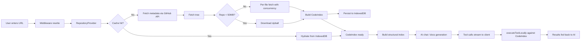
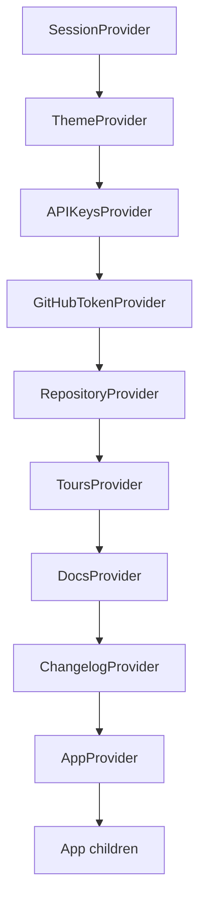
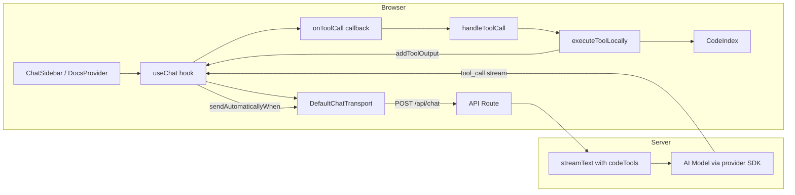
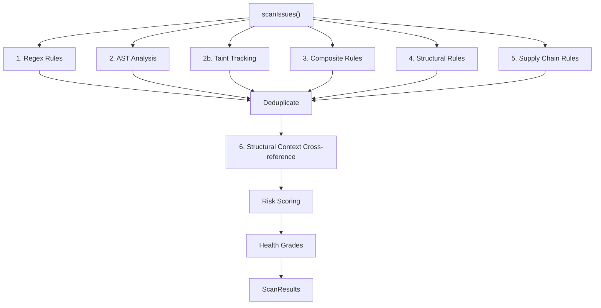

# Architecture

RepoLens is a client-heavy Next.js application that connects to GitHub repositories, indexes their source code in the browser, and provides AI-powered chat, documentation generation, code scanning, and diagram generation — all without a traditional backend database.

## Overview

Users paste a GitHub URL (or navigate to `/:owner/:repo`). The app fetches the repository tree and file contents, builds an in-memory `CodeIndex`, caches it in IndexedDB, and exposes it to AI models through client-side tool execution. The AI never sees raw file contents in its context window — instead it receives a compact structural index and calls tools (`readFile`, `searchFiles`, etc.) that execute locally in the browser against the `CodeIndex`.

## Data Flow

### Step-by-step

1. **URL entry** — The user enters a GitHub URL or navigates to `/:owner/:repo`.
2. **Middleware rewrite** — Next.js middleware rewrites `/:owner/:repo` to `/?repo=https://github.com/owner/repo`, preserving query params. Reserved segments (`api`, `_next`, `compare`, etc.) are excluded.
3. **Metadata fetch** — `RepositoryProvider.connectRepository()` parses the URL, calls `fetchRepoMetadata()` via the GitHub REST API.
4. **Tree fetch** — `fetchRepoTree()` retrieves the recursive tree for the default branch.
5. **Cache check** — The provider checks IndexedDB (`getCachedRepo`) for a cached entry matching the tree SHA. On hit, the `CodeIndex` is hydrated immediately from cache.
6. **Content fetch** — On cache miss, the provider attempts a zipball download for repos under 50 MB. If that fails or the repo is larger, it falls back to per-file fetching with a concurrency limit of 10.
7. **Indexing** — `batchIndexFiles()` builds the `CodeIndex` — a `Map<string, IndexedFile>` with split lines, language detection, and file metadata.
8. **Cache persist** — The indexed data is written to IndexedDB with LRU eviction (max 5 repos).
9. **Structural index** — On chat/docs requests, `buildStructuralIndex()` extracts exports, imports, and symbol signatures from the `CodeIndex` into a compact JSON string sized to ~15% of the model's context window.
10. **AI interaction** — The structural index and file tree are sent as context. Tool calls stream back and are executed locally by `executeToolLocally()`.

## Provider Architecture

The app uses eight nested React Context providers. The nesting order determines dependency availability — inner providers can consume outer providers via hooks.

| Provider | Purpose | Key State |
| -------- | ------- | --------- |
| **SessionProvider** | NextAuth session management for GitHub OAuth | Session, auth status |
| **ThemeProvider** | Dark/light/system theme via `next-themes` | Theme preference |
| **APIKeysProvider** | Manages AI provider API keys (OpenAI, Anthropic, Google, OpenRouter), model selection, and key validation | API keys in localStorage, selected model, available models |
| **RepositoryProvider** | Fetches, indexes, and caches repository data. Manages the `CodeIndex`, search state, modified file contents, and codebase analysis | `GitHubRepo`, file tree, `CodeIndex`, loading stage, indexing progress, `FullAnalysis` |
| **DocsProvider** | Hosts the `useChat` instance for documentation generation. Splits into two sub-contexts: `DocsStateContext` (generated docs list) and `DocsChatContext` (streaming chat state) | Generated docs, active doc ID, chat messages/status |
| **ToursProvider** | Manages repo tours: CRUD, playback state, active tour/stop tracking. Persists tours in IndexedDB via `tour-cache.ts`. Split contexts (state + playback) | Tours list, active tour, current stop index, playback state |
| **ChangelogProvider** | Hosts `useChat` for changelog generation. Split contexts like DocsProvider (State + Chat) | Generated changelogs, active ID, chat streaming state |
| **AppProvider** | Lightweight global UI state. Tracks selected file path for cross-feature coordination (e.g., blame view) | Preview URL, generating flag, sidebar width, selected file path |

`ComparisonProvider` is used locally on the `/compare` page, not in the global provider tree.

## AI Chat System

The chat system uses Vercel AI SDK v6 with a **client-side tool execution** pattern — tools have schemas but no server-side `execute` function.

### Chat Flow

### How it works

1. **User sends message** — `ChatSidebar.handleSubmit()` calls `sendMessage()` with the message text and a body containing the selected model, API key, repo context, and structural index.
2. **Server receives request** — The API route (`/api/chat` or `/api/docs/generate`) validates the request with Zod, applies rate limiting via `applyRateLimit()`, and delegates to `repoLensAgent` which uses `createAgentUIStreamResponse` to stream the response.
3. **Tools have no `execute`** — The `codeTools` object defines 11 tools using `tool()` from the AI SDK, each with a Zod `inputSchema` but no `execute` function. This means tool calls are streamed to the client instead of being executed on the server.
4. **Client intercepts tool calls** — The `useChat` hook's `onToolCall` callback fires for each tool call. It delegates to `handleToolCall()`, which calls `executeToolLocally()`.
5. **Local execution** — `executeToolLocally()` runs the tool against the in-memory `CodeIndex`: reading files, searching content, listing directories, finding symbols, scanning issues, or generating diagrams.
6. **Results fed back** — Tool results are passed to `addToolOutput()`, which adds them to the message stream.
7. **Automatic re-send** — `sendAutomaticallyWhen: lastAssistantMessageIsCompleteWithToolCalls` triggers an automatic re-send when the assistant's last message ends with completed tool calls, enabling multi-step tool use.
8. **Context compaction** — For long sessions, `createContextCompactor()` truncates older tool results to keep the context within bounds, using structural summaries instead of raw truncation.

### Tool Definitions

| Tool | Description |
| ---- | ----------- |
| `readFile` | Read file contents (full or line range) |
| `readFiles` | Batch-read up to 10 files |
| `searchFiles` | Search by path pattern or content (supports regex) |
| `listDirectory` | List directory contents |
| `findSymbol` | Find function/class/type definitions by name |
| `getFileStats` | Get file statistics (lines, language, imports, exports) |
| `analyzeImports` | Analyze import/export relationships |
| `scanIssues` | Run security and quality scanner on a file |
| `generateDiagram` | Generate Mermaid diagrams (summary, topology, import-graph) |
| `generateTour` | Generate an interactive code tour with ordered stops |
| `getProjectOverview` | Get project-wide statistics and structure |

### Context Compaction

The `createContextCompactor()` function generates a `prepareStep` callback used by the ToolLoopAgent's `prepareStep` pipeline that trims older tool-result messages. It scales thresholds based on the model's context window:

- **Large context (500K+ tokens)**: 3x limit multiplier, keep 35% of steps full
- **Standard context (128K-500K)**: 1x multiplier, keep 25% full
- **Small context (<128K)**: 0.8x multiplier, keep 20% full

For Anthropic models, native context management (`clear_tool_uses_20250919` and `compact_20260112`) is also enabled when compaction is active.

## Scanner Engine

The scanner detects security vulnerabilities, code quality issues, and supply chain risks by running multiple analysis passes over the `CodeIndex`.

### Scan Pipeline

### Rule Types

| Rule Type | Module | How It Works |
| --------- | ------ | ------------ |
| **Regex** | `rules-security.ts`, `rules-quality.ts`, `rules-framework.ts`, `rules-security-lang.ts` | Pattern matching via `searchIndex()`. Supports file type filters, exclude patterns, context-aware suppression (comments, tests, type annotations) |
| **AST** | `ast-analyzer.ts`, `ast-parser.ts` | Parses source into AST nodes, analyzes control flow, detects structural patterns (empty catch, eval usage, unsafe assignments) |
| **Composite** | `rules-composite.ts` | Multi-pattern rules: ALL `requiredPatterns` must appear in the same file, reported at the `sinkPattern` line |
| **Taint** | `taint-tracker.ts` | Tracks data flow from sources (user input) through the AST to sinks (SQL queries, DOM manipulation), detecting unsanitized paths |
| **Structural** | `structural-scanner.ts` | Uses the dependency graph to detect circular dependencies, large files (>400 lines), high coupling (15+ importers), and dead modules |
| **Supply Chain** | `supply-chain-scanner.ts` | Scans `package.json` lifecycle scripts, lockfiles, GitHub Actions workflows, and Python dependency files for suspicious patterns |
| **Entropy** | `entropy.ts` | Shannon entropy analysis to distinguish real secrets from placeholder values in credential-pattern matches |

### Scoring and Grading

- **Risk Score**: Each issue receives a CVSS-like score (0.0–10.0) via `scoreIssue()` based on severity, category, confidence, and CWE.
- **Project Risk Score**: Weighted average of all issue scores via `scoreProject()`.
- **Health Grade**: A–F based on absolute severity penalty (critical: -30, warning: -8, info: -2). Critical issues cap the score at 35.
- **Security Grade**: Same formula but only security-category issues.
- **Quality Grade**: Density-based (issues per KLOC).
- **Compliance**: Maps issues to OWASP Top 10 2025 and CWE Top 25 2024 via `compliance-matrix.ts`.

### Suppression and Context

The scanner uses context classification (`context-classifier.ts`) to reduce false positives:

- **Comment suppression**: Issues in comments are suppressed (except security-critical rules).
- **Test/generated/example files**: Non-security issues suppressed in test and generated files.
- **Type annotation suppression**: Credential patterns in TypeScript type annotations are skipped.
- **Inline suppression**: `// repolens-ignore` or `// repolens-ignore:rule-id` comments suppress specific findings.
- **Sanitizer detection**: If a sanitizer function is found near a security finding, confidence is lowered.
- **Dynamic confidence**: Adjusts confidence based on context (config files boost credential findings, dead code lowers severity).

### Memoization

`scanIssues()` is memoized by `CodeIndex` reference using `WeakRef`. Multiple components (code browser, issues panel) calling with the same index get cached results.

## Docs Generation

Documentation is generated using the AI chat system with specialized system prompts per document type.

### Doc Types

| Type | Prompt Focus |
| ---- | ------------ |
| `architecture` | System structure, modules, data flow, design decisions |
| `setup` | Prerequisites, installation, configuration, running locally |
| `api-reference` | Exported functions, types, signatures, usage examples |
| `file-explanation` | Deep dive into a specific file's purpose and logic |
| `custom` | User-provided free-form prompt |

### Generation Flow

1. **User selects preset** — In DocViewer, user picks a doc type and optional target file.
2. **`useDocsEngine` orchestrates** — The hook manages generation lifecycle: context setup, message sending, completion handling, and doc persistence.
3. **Context is set** — `setGenContext()` pushes `{ docType, targetFile, customPrompt, maxSteps }` to the provider's ref.
4. **Transport sends request** — `DocsProvider`'s stable `DefaultChatTransport` reads the current model, API keys, repo context, and structural index from refs at request time, posting to `/api/docs/generate`.
5. **Server streams response** — The docs API route uses the same `codeTools` and `streamText()` pattern as chat, but with doc-type-specific system prompts.
6. **Tool calls execute locally** — Same `onToolCall` → `handleToolCall` → `executeToolLocally` pattern as chat.
7. **Doc is saved** — When generation completes (status transitions from streaming to ready), `useDocsEngine` creates a `GeneratedDoc` record stored in the `DocsProvider` state.

### DocsProvider Architecture

`DocsProvider` splits into two React contexts to minimize re-renders:

- **DocsStateContext** (rarely changes): `generatedDocs[]`, `activeDocId`, `showNewDoc`
- **DocsChatContext** (changes during streaming): `messages`, `status`, `error`, `isGenerating`

The `useChat` instance lives in the provider so chat state survives component unmounts. A single stable `DefaultChatTransport` reads dynamic values from refs to avoid recreating the Chat instance.

## Diagram Generation

Diagrams are generated from the `FullAnalysis` (dependency graph and topology analysis) computed after indexing.

### Diagram Types

| Type | Generator | Output |
| ---- | --------- | ------ |
| `summary` | `generateProjectSummary()` | `ProjectSummary` data object (language breakdown, hubs, consumers, health issues, folder breakdown) |
| `topology` | `generateTopologyDiagram()` | Mermaid flowchart with nodes colored by topology role (entry, hub, connector, leaf, orphan) |
| `imports` | `generateImportGraph()` | Mermaid flowchart showing import relationships. Collapses to directory-level for repos with 50+ files |
| `classes` | `generateClassDiagram()` | Mermaid class diagram from extracted classes and interfaces |
| `entrypoints` | `generateEntryPoints()` | Mermaid flowchart showing entry point files and their dependencies |
| `modules` | `generateModuleUsageTree()` | Mermaid flowchart of module usage patterns |
| `treemap` | `generateTreemap()` | Hierarchical tree data for visual treemap rendering |
| `externals` | `generateExternalDeps()` | Mermaid flowchart of external package dependencies |
| `focus` | `generateFocusDiagram()` | Mermaid flowchart centered on a specific file showing N-hop neighbors |

### Generation Pipeline

1. **Analysis phase** — `analyzeCodebase(codeIndex)` runs 5 phases:
   - Phase 1: Per-file analysis (imports, exports, types, classes, JSX components)
   - Phase 2: Build dependency graph (edges, reverse edges, external deps)
   - Phase 3: Circular dependency detection via DFS
   - Phase 4: Topology analysis (entry points, hubs, orphans, leaves, connectors, clusters)
   - Phase 5: Framework detection
2. **Diagram dispatch** — `generateDiagram(type, codeIndex, files, analysis)` routes to the appropriate generator.
3. **Adaptive rendering** — Generators automatically collapse to directory-level representation when file count exceeds thresholds (e.g., 50 for import graphs, 80 for topology).

## Chat Context Pinning

Users pin files or folders to the AI chat context for targeted analysis. Pinned files are stored in `RepositoryProvider` state as a set of file paths. When sending a message, pinned file contents are fetched from the `CodeIndex` and injected into the system prompt after the file tree.

### Constraints

- Maximum 20 pinned files
- Maximum 100 KB total pinned content
- Maximum 50 KB per individual file
- Limits are configurable via `PINNED_CONTEXT_CONFIG` in the chat system

### Pinning Flow

1. **User pins files** — The file tree and code browser expose pin/unpin actions that update `RepositoryProvider.pinnedFiles`.
2. **Context injection** — On chat submit, `ChatSidebar` reads pinned file paths, resolves their content from the `CodeIndex`, and appends them to the request body.
3. **System prompt** — The API route inserts pinned file contents into the system prompt between the file tree and the structural index, giving the AI direct access to the pinned code without requiring tool calls.

## Inline Code Actions

A hover action bar appears on code symbols (functions, classes) in the code browser. Actions include Explain, Refactor, Find Usages, and Complexity analysis.

### Action Flow

1. **Symbol detection** — `computeSymbolRanges()` identifies function and class boundaries in the current file using declaration patterns.
2. **Action trigger** — Clicking an action (Explain, Refactor, Complexity) sends a `POST` request to `/api/inline-actions` with the symbol text and the selected action type.
3. **AI streaming** — The API route streams back markdown analysis displayed in a slide-out panel overlaying the code browser.
4. **Find Usages** — Runs entirely client-side via `CodeIndex.searchFiles()`, displaying results inline without an API call.

## Dependency Health Dashboard

Scores npm dependencies on four axes graded A–F, rendered in a sortable table with download sparklines and a detail drawer.

### Scoring

| Axis | Weight | Data Source |
| ---- | ------ | ----------- |
| Downloads | 20% | npm registry download counts |
| Maintenance | 30% | Last publish date, open issues ratio |
| Security | 30% | OSV.dev vulnerability database |
| Freshness | 20% | Semver distance from latest version |

### Pipeline

1. **API route** — `/api/deps` receives the dependency list from `package.json`, calls npm registry and OSV.dev APIs with `mapWithConcurrency(10)` to limit parallel requests.
2. **Rate limiting** — 429 responses trigger automatic retry with exponential backoff.
3. **Scoring** — `health-scorer.ts` computes per-axis scores and a weighted overall grade (A–F).
4. **UI** — `DepsPanel` renders a summary bar, sortable `DepsTable`, download `DownloadSparkline` charts, and a `DepsDetailDrawer` for per-package deep dives.

## Annotated Repo Tours

Interactive code tours stored in IndexedDB. Each tour has ordered stops — a file path, line range, and markdown annotation. Tours can be created manually or generated by AI.

### Data model

- **Tour**: `{ id, repoFullName, title, description, stops[], createdAt }`
- **Stop**: `{ file, startLine, endLine, title, annotation }`
- Types are defined in `types/tours.ts`.

### Tour Lifecycle

1. **CRUD** — `ToursProvider` manages tour state. Create, update, and delete operations persist to IndexedDB via `tour-cache.ts`.
2. **Playback** — The provider tracks `activeTour`, `currentStopIndex`, and `isPlaying`. Navigation (next/prev stop) updates the code browser's selected file and scroll position.
3. **AI generation** — The `generateTour` AI tool selects key files, identifies important line ranges using declaration patterns, and generates educational annotations. The tool result is parsed and persisted as a new tour.
4. **Rendering** — The tour player highlights the target line range in the code editor with a `bg-blue-500/10` overlay and displays the stop annotation in a side panel.

## AI Changelog Generator

Generates changelogs from Git ref ranges using AI with configurable presets.

### Presets

| Preset | Description |
| ------ | ----------- |
| Conventional | Groups by type (feat, fix, chore) following Conventional Commits |
| Release Notes | User-facing summary with highlights |
| Keep a Changelog | Follows [keepachangelog.com](https://keepachangelog.com) format |
| Custom | User-provided free-form instructions |

### Changelog Generation Flow

1. **User selects refs** — In `NewChangelogView`, the user picks base and head refs (tags or branches), a preset, and a quality level (Fast / Balanced / Thorough).
2. **Commit fetching** — Commits between the refs are fetched via `fetchCommitsViaProxy` and `fetchCompareViaProxy` from the GitHub API.
3. **AI generation** — Commits are sent to `/api/changelog/generate` with a preset-specific system prompt built by `prompt-builder.ts`. The AI streams back a formatted changelog.
4. **Regeneration** — Stored commit data enables regeneration with a different preset or quality level without re-fetching.
5. **Provider** — `ChangelogProvider` uses the same split-context pattern as `DocsProvider`: `ChangelogStateContext` (changelog list, active ID) and `ChangelogChatContext` (streaming state).

## Git History & Blame Explorer

Line-by-line blame, commit timeline, file-specific history, and commit detail with unified diff rendering.

### Data sources

- **Blame**: GitHub GraphQL API (`/api/github/blame` → `lib/github/graphql.ts`). Requires authentication.
- **Commits**: GitHub REST API (`/api/github/commits`), paginated.
- **Commit detail**: GitHub REST API (`/api/github/commit/[sha]`), includes patch data.

### View Pipeline

1. **Blame view** — `BlameView` fetches blame data for the currently selected file via the GraphQL proxy. Blame ranges are expanded into per-line annotations by `blame-utils.ts`. Lines are colored with an age-based heatmap (newer = green, older = red).
2. **Commit timeline** — `CommitTimeline` fetches paginated commit history and groups commits by date using `commit-utils.ts`.
3. **File history** — `FileHistoryList` shows commits that modified a specific file, driven by the `path` query parameter on the commits API.
4. **Commit detail** — `CommitDetailView` fetches a single commit's metadata and patch. `parsePatch()` in `diff-utils.ts` converts unified diffs into structured hunks with line numbers for rendering.
5. **File sync** — `AppProvider.selectedFilePath` syncs the currently selected file from the code browser, enabling file-aware blame without explicit user selection.

## Module Relationships

```mermaid
graph TD
  subgraph Providers
    P1["SessionProvider"]
    P2["APIKeysProvider"]
    P3["RepositoryProvider"]
    P4["DocsProvider"]
    P5["AppProvider"]
    P6["ComparisonProvider"]
    P7["ToursProvider"]
    P8["ChangelogProvider"]
  end

  subgraph LibGitHub["lib/github"]
    G1["fetcher.ts"]
    G2["parser.ts"]
    G3["client.ts"]
    G4["zipball.ts"]
    G5["graphql.ts"]
  end

  subgraph LibAI["lib/ai"]
    A1["tool-definitions.ts"]
    A2["tool-schemas.ts"]
    A3["client-tool-executor.ts"]
    A4["tool-call-handler.ts"]
    A5["structural-index.ts"]
    A6["providers.ts"]
    A7["context-compactor.ts"]
    A8["agent/agent.ts"]
    A9["skills/registry.ts"]
  end

  subgraph LibCode["lib/code"]
    C1["code-index.ts"]
    C2["import-parser.ts"]
    C3["parser/analyzer.ts"]
    C4["scanner/scanner.ts"]
  end

  subgraph LibDiagrams["lib/diagrams"]
    D1["generators/index.ts"]
    D2["types.ts"]
  end

  subgraph LibDeps["lib/deps"]
    DP1["health-scorer.ts"]
    DP2["npm-client.ts"]
    DP3["version-checker.ts"]
  end

  subgraph LibChangelog["lib/changelog"]
    CL1["preset-config.ts"]
    CL2["prompt-builder.ts"]
  end

  subgraph LibGitHistory["lib/git-history"]
    GH1["blame-utils.ts"]
    GH2["commit-utils.ts"]
    GH3["diff-utils.ts"]
  end

  subgraph LibCache["lib/cache"]
    CA1["repo-cache.ts"]
    CA2["tour-cache.ts"]
    CA3["memory-cache.ts"]
  end

  subgraph APIRoutes["app/api"]
    R1["/api/chat"]
    R2["/api/docs/generate"]
    R3["/api/github/*"]
    R4["/api/models/*"]
    R5["/api/deps"]
    R6["/api/inline-actions"]
    R7["/api/changelog/generate"]
    R8["/api/github/blame"]
    R9["/api/github/commit/[sha]"]
  end

  P3 --> G1
  P3 --> G4
  P3 --> C1
  P3 --> CA1
  P3 --> C2
  P4 --> A4
  P4 --> A5
  P4 --> A6
  P7 --> CA2
  P8 --> A4
  P8 --> A6

  R1 --> A8
  R1 --> A6
  R1 --> A7
  R2 --> A8
  R2 --> A6
  R2 --> A7
  R5 --> DP2
  R6 --> A6
  R7 --> A6
  R7 --> CL2
  R8 --> G5

  A8 --> A1
  A8 --> A6
  A8 --> A7
  A8 --> A9
  A1 --> A2
  A3 --> A2
  A3 --> C1
  A3 --> C4
  A4 --> A3
  A5 --> C1
  A7 --> A5

  C4 --> C1
  C4 --> C2
  D1 --> C2
  D1 --> C1
  G3 --> CA3

  R3 --> G1
  R8 --> G1
  R9 --> G1
```

## Key Design Patterns

### Client-Side Tool Execution

The most distinctive pattern in the codebase. AI tool definitions on the server have Zod schemas but no `execute` function, causing tool calls to stream to the client. The browser executes them against the local `CodeIndex` and feeds results back via `addToolOutput()`. This eliminates server-side file storage and reduces API route complexity — the server only proxies AI model calls.

### IndexedDB Caching with LRU Eviction

Repository data is cached in IndexedDB (`repolens-cache` database, `repos` object store) keyed by `owner/repo`. Cache freshness is determined by tree SHA comparison. LRU eviction keeps at most 5 repos, sorting by last-access timestamp. Cache writes are fire-and-forget (non-critical path).

### Provider Composition with Ref-Based Stability

Providers like `DocsProvider` use `useRef` for frequently-changing values (selected model, API keys, code index) and create a single stable `DefaultChatTransport` in `useMemo(() => ..., [])`. This prevents the AI SDK's `useChat` from being recreated when dynamic values change — a critical pattern since the Chat instance is initialized once and reuses its transport.

### Structural Index

Instead of sending raw file contents to the AI, `buildStructuralIndex()` extracts a compact JSON array of `{ path, language, lineCount, exports, imports, signatures }` per file. The index is progressively trimmed (signatures → imports → exports) to fit within a byte budget calculated as 10-15% of the model's context window. This gives the AI enough information to make informed tool calls without wasting context.

### Memoized Scanning

`scanIssues()` uses `WeakRef<CodeIndex>` to cache results. When multiple components request a scan of the same `CodeIndex` instance, the cached result is returned immediately. The cache is invalidated when the `CodeIndex` reference changes.

### Multi-Phase Code Analysis

`analyzeCodebase()` runs a 5-phase pipeline (per-file analysis → dependency graph → circular detection → topology → framework detection) producing a `FullAnalysis` object that powers both diagrams and structural scanning. The analysis is computed once after indexing completes (debounced by 50ms) and stored in `RepositoryProvider`.

### Middleware URL Rewriting

The Next.js middleware enables clean URLs (`/owner/repo`) by rewriting to `/?repo=https://github.com/owner/repo`. It uses a reserved-segment set and GitHub-name regex validation to distinguish repo paths from app routes. Security headers (X-Frame-Options, X-Content-Type-Options, etc.) are added to all responses.

## Extension Points

### Adding a New AI Tool

1. **Define the schema** in `lib/ai/tool-schemas.ts` using Zod.
2. **Add the tool definition** in `lib/ai/tool-definitions.ts` using `tool()` with a description and `inputSchema` (no `execute`).
3. **Implement the executor** in `lib/ai/client-tool-executor.ts` — add a case to the `switch (toolName)` in `executeToolLocally()`.
4. The tool is automatically available via the `repoLensAgent` ToolLoopAgent (imported in `lib/ai/agent/agent.ts`). Chat, docs, and changelog routes all use the same agent instance.

### Adding a New Scanner Rule

**Regex rule**: Add an entry to the appropriate array in `lib/code/scanner/rules-security.ts`, `rules-quality.ts`, or `rules-framework.ts` following the `ScanRule` interface (id, pattern, severity, category, description, fileFilter, etc.).

**Composite rule**: Add to `COMPOSITE_RULES` in `rules-composite.ts` with `requiredPatterns[]` (all must match in the same file) and `sinkPattern` (line to report on).

**AST rule**: Extend `analyzeAST()` in `ast-analyzer.ts` to detect new patterns in the parsed syntax tree.

**Structural rule**: Add detection logic to `scanStructuralIssues()` in `structural-scanner.ts` using the dependency graph and topology data.

### Adding a New Diagram Type

1. **Add the type** to the `DiagramType` union in `lib/diagrams/types.ts`.
2. **Create a generator** in `lib/diagrams/generators/` following the pattern of existing generators (takes `FullAnalysis`, returns `MermaidDiagramResult` or a custom result type).
3. **Register in dispatcher** — add a case to `generateDiagram()` in `lib/diagrams/generators/index.ts`.
4. **Add UI entry** in the diagram selector component to make it available to users.

### Adding a New Provider

1. **Create the provider** in `providers/` with a React context, provider component, and consumer hook.
2. **Nest it** in `providers/index.tsx` at the appropriate position in the chain (outer providers are available to inner providers).
3. **Export the hook** from `providers/index.tsx`.

### Adding a New Doc Type

1. **Add the type** to the `DocType` union in `providers/docs-provider.tsx`.
2. **Add a preset** to `DOC_PRESETS` with label, description, and default prompt.
3. **Add a system prompt** in `lib/ai/agent/prompts/docs.ts` for the new doc type.

### Adding a New Preview Tab

1. **Create components** in `components/features/<feature>/`.
2. **Add the tab** to `PREVIEW_TABS` in `components/features/preview/tab-config.ts` (icon from `lucide-react`).
3. **Add lazy import + tab case** in `components/features/preview/preview-panel.tsx` with `FeatureErrorBoundary` + `Suspense`.
4. **Add skeleton** to `components/features/loading/tab-skeleton.tsx`.
5. **Add the view ID** to the `ViewId` union in `lib/export/shareable-url.ts`.
6. **Add business logic** in `lib/<feature>/`.
7. **Create a provider** if the feature needs shared state (see Adding a New Provider).

### Adding a New Changelog Preset

1. **Add the preset key** to the `ChangelogPreset` union in `lib/changelog/types.ts`.
2. **Define the preset config** in `PRESET_CONFIGS` in `lib/changelog/preset-config.ts` (label, description, system prompt template).
3. **Template interpolation** — The prompt template supports `{{commits}}` and `{{dateRange}}` placeholders via `lib/changelog/prompt-builder.ts`.
4. The preset appears automatically in the `NewChangelogView` component selector.

## Skills System

The skills system provides specialized analysis methodologies that the AI can load on-demand. See the `lib/ai/skills/` module for implementation details.

- **16 skill definitions** stored as `.md` files with YAML frontmatter in `lib/ai/skills/definitions/`.
- **SkillRegistry** lazily loads and caches skill definitions, validates frontmatter via Zod, and enforces filename-to-ID consistency.
- **Server-executed tools** (`discoverSkills`, `loadSkill`) allow the AI to discover and load skills at runtime.
- **UI**: `SkillSelector` component lets users pre-select skills before chatting.

## Rate Limiting

All AI API routes apply rate limiting via `lib/api/rate-limit.ts` using `applyRateLimit()`. The function returns `null` if allowed, or a `429` response with `Retry-After` and `X-RateLimit-*` headers if the limit is exceeded. Error responses use the standardized `apiError()` helper from `lib/api/error.ts`.
