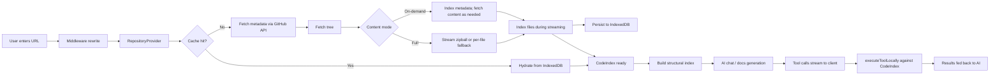
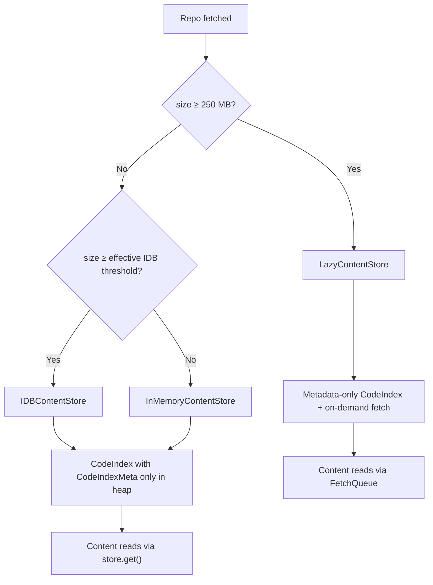
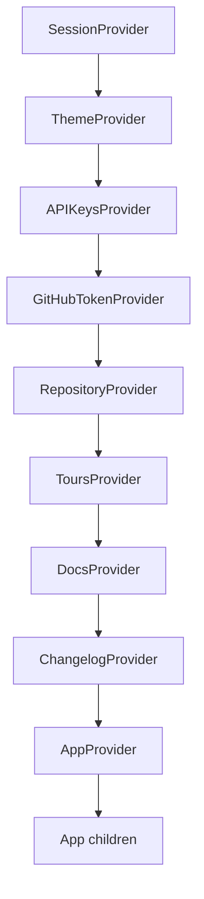
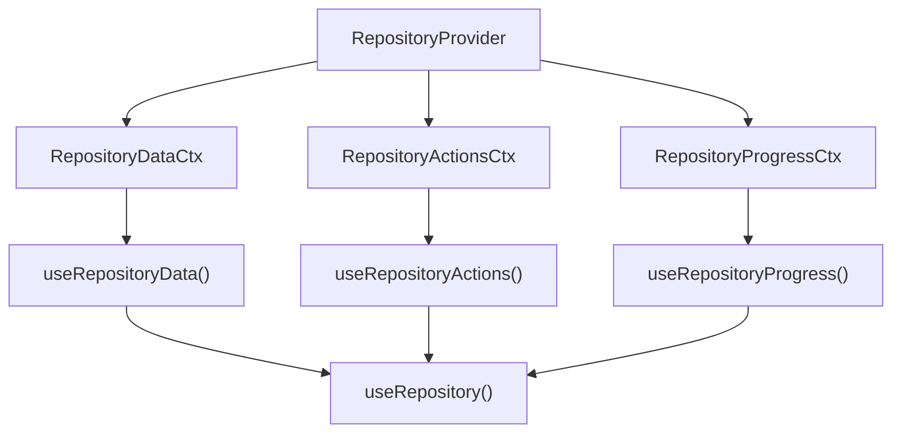
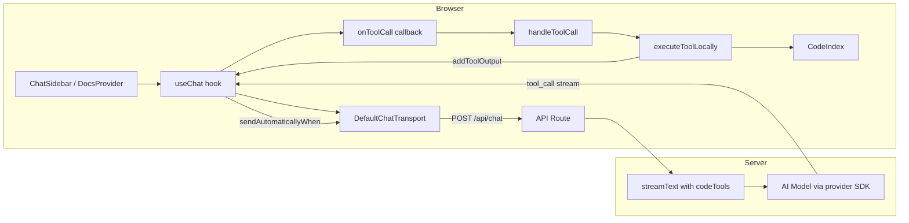
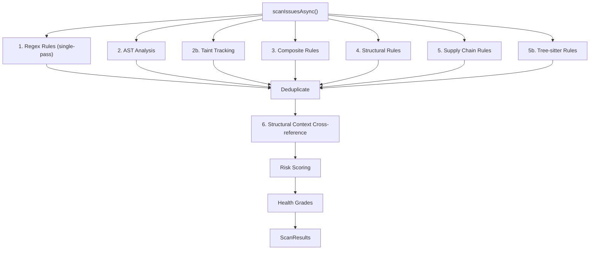
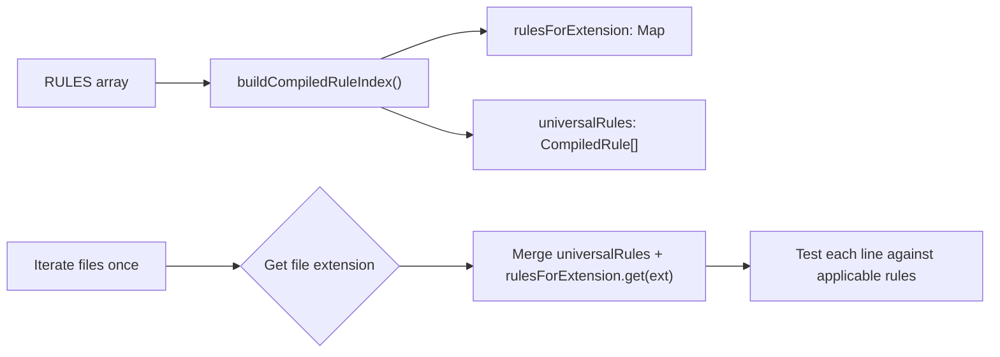
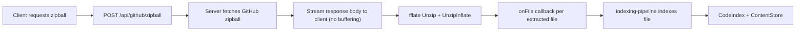
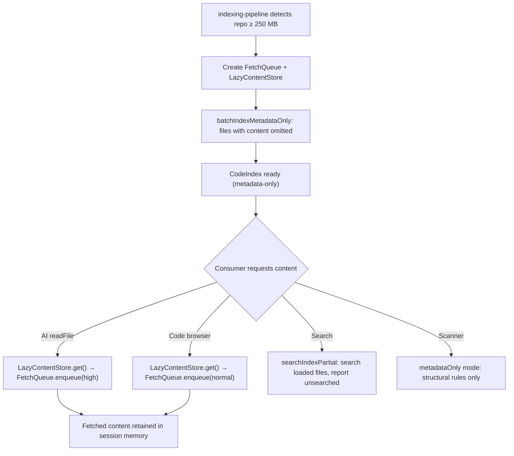

# Architecture

RepoLens is a client-heavy Next.js application that connects to GitHub repositories, indexes their source code in the browser, and provides AI-powered chat, documentation generation, code scanning, and diagram generation — all without a traditional backend database.

## Overview

Users paste a GitHub URL (or navigate to `/:owner/:repo`). The app resolves the repository tree, loads supported file content, builds a `CodeIndex`, and caches only complete, failure-free indexes in IndexedDB. AI tools execute against the browser index, but AI requests still send the user's key, prompt, selected repository context, and tool results through the RepoLens server to the selected provider.

## Data Flow

```mermaid
graph LR
  A["User enters URL"] --> B["Middleware rewrite"]
  B --> C["RepositoryProvider"]
  C --> D{"Cache hit?"}
  D -->|Yes| E["Hydrate from IndexedDB"]
  D -->|No| F["Fetch metadata via GitHub API"]
  F --> G["Fetch tree"]
  G --> H{"Content mode"}
  H -->|Full| I["Stream zipball or per-file fallback"]
  H -->|On-demand| J["Index metadata; fetch content as needed"]
  I --> K["Index files during streaming"]
  J --> K
  K --> L["Persist to IndexedDB"]
  E --> M["CodeIndex ready"]
  K --> M
  M --> N["Build structural index"]
  N --> O["AI chat / docs generation"]
  O --> P["Tool calls stream to client"]
  P --> Q["executeToolLocally against CodeIndex"]
  Q --> R["Results fed back to AI"]
```

### Step-by-step

1. **URL entry** — The user enters a GitHub URL or navigates to `/:owner/:repo`.
2. **Middleware rewrite** — Next.js middleware rewrites `/:owner/:repo` to `/?repo=https://github.com/owner/repo`, preserving query params. Reserved segments (`api`, `_next`, `compare`, etc.) are excluded.
3. **Metadata fetch** — `RepositoryProvider.connectRepository()` parses the URL and calls `fetchRepoViaProxy()` through the authenticated GitHub client.
4. **Tree fetch** — The adaptive resolver retrieves the recursive tree and splits truncated subtrees within request/time budgets. Partial discovery remains usable and is represented explicitly in repository coverage.
5. **Cache check** — The provider checks IndexedDB (`getCachedRepo`) for a cached entry matching the tree SHA. On hit, the `CodeIndex` is hydrated immediately from cache.
6. **Content fetch** — On cache miss, the provider attempts a streaming zipball download for repos under 250 MB. The server streams the GitHub zipball response body directly (no buffering), and the client uses fflate's streaming `Unzip` + `UnzipInflate` to extract and index files as chunks arrive, reducing peak memory from ~3–4× zip size to ~1×. If streaming extraction fails or the repo is larger, it falls back to per-file fetching with concurrency.
7. **Indexing** — `batchIndexFiles()` builds the `CodeIndex` — a `Map<string, IndexedFile>` with split lines, language detection, and file metadata.
8. **Cache persist** — Complete, failure-free indexed data is written to IndexedDB with LRU eviction (max 5 repos). Partial sessions are not reused as complete caches.
9. **Structural index** — On chat/docs requests, `buildStructuralIndexAsync()` extracts exports, imports, and symbol signatures from the `CodeIndex` into a compact JSON string sized to ~15% of the model's context window.
10. **AI interaction** — Selected repository context is sent through the server to the provider inside a typed untrusted-data envelope. Tool calls stream back, execute locally through `executeToolLocally()`, and their results return through the server/provider boundary.

## ContentStore (Tiered Content Storage)

File content storage uses a three-tier routing strategy based on repository size. All tiers implement the `ContentStore` interface defined in `lib/code/content-store.ts`. The `CodeIndex` always holds `CodeIndexMeta` records (path, name, language, line count, and whether that count is known) in memory for fast metadata access regardless of which store backs the content. Aggregate line totals are explicitly partial while any source-derived count is unavailable.

### Three-Tier Size-Based Routing

```mermaid
graph TD
  A["Repo fetched"] --> B{"size ≥ 250 MB?"}
  B -->|Yes| C["LazyContentStore"]
  B -->|No| D{"size ≥ effective IDB threshold?"}
  D -->|Yes| E["IDBContentStore"]
  D -->|No| F["InMemoryContentStore"]
  C --> G["Metadata-only CodeIndex + on-demand fetch"]
  E --> H["CodeIndex with CodeIndexMeta only in heap"]
  F --> H
  G --> I["Content reads via FetchQueue"]
  H --> J["Content reads via store.get()"]
```

| Tier | Store | Size Range | Content Strategy |
| ---- | ----- | ---------- | ---------------- |
| In-Memory | `InMemoryContentStore` | Below effective IDB threshold | Zero-overhead `Map<string, string>` wrapper. All content in JS heap |
| IDB | `IDBContentStore` | Effective IDB threshold to < 250 MB | Content in IndexedDB (`repolens-content`), metadata in heap |
| Lazy | `LazyContentStore` | ≥ 250 MB | Metadata indexed immediately, content fetched on demand via `FetchQueue` |

- Thresholds are configured via `IDB_CONTENT_STORE_THRESHOLD_KB` (50,000 KB by default; 25,000 KB on devices reporting at most 4 GB of memory) and `LAZY_CONTENT_THRESHOLD_KB` (250,000 KB) in `config/constants.ts`.
- `indexing-pipeline.ts` checks repo size to choose the store tier.
- During indexing, content is written to the chosen store. `CodeIndex.files` holds metadata-only `CodeIndexMeta` entries when IDB or Lazy is active.
- For IDB-tier repos, `IndexedFile.content` is set during indexing but stripped from the JS heap afterward — consumers access content via `contentStore.get()` or the async helpers in `code-index.ts` (see [Content Stripping (Phase 6)](#content-stripping-phase-6)).

### Worker Optimization

Search and scanner workers use `IDBContentStore` directly for large repos, reading file content from IndexedDB without marshalling through the main thread. This keeps heavy analysis off the main thread while avoiding the memory cost of duplicating content in worker heaps.

### Key Types

| Type | Location | Purpose |
| ---- | -------- | ------- |
| `ContentStore` | `lib/code/content-store.ts` | Interface for content storage (get, getSync, getBatch, put, has, delete) |
| `InMemoryContentStore` | `lib/code/content-store.ts` | Map-backed store below the effective IDB threshold |
| `IDBContentStore` | `lib/code/content-store.ts` | IndexedDB-backed store below the 250 MB lazy threshold |
| `LazyContentStore` | `lib/code/content-store.ts` | On-demand fetch store for repos 250 MB or larger |
| `FetchQueue` | `lib/code/fetch-queue.ts` | Priority-based concurrency-limited fetch queue |
| `CodeIndexMeta` | `lib/code/content-store.ts` | Metadata-only file record (path, name, language, lineCount) |
| `ContentAvailability` | `lib/repository/repo-state.ts` | UI state: `'full'` or `'metadata-only'` |

## Provider Architecture

The app uses nine nested React Context providers. The nesting order determines dependency availability — inner providers can consume outer providers via hooks.

```mermaid
graph TD
  A["SessionProvider"] --> B["ThemeProvider"]
  B --> C["APIKeysProvider"]
  C --> C2["GitHubTokenProvider"]
  C2 --> D["RepositoryProvider"]
  D --> E["ToursProvider"]
  E --> F["DocsProvider"]
  F --> G["ChangelogProvider"]
  G --> H["AppProvider"]
  H --> I["App children"]
```

| Provider | Purpose | Key State |
| -------- | ------- | --------- |
| **SessionProvider** | NextAuth session management for GitHub OAuth | Session, auth status |
| **ThemeProvider** | Dark/light/system theme via `next-themes` | Theme preference |
| **APIKeysProvider** | Manages AI provider API keys (OpenAI, Anthropic, Google, OpenRouter), model selection, and key validation | API keys in localStorage, selected model, available models |
| **RepositoryProvider** | Fetches, indexes, and caches repository data. Splits into 3 sub-contexts for render isolation (see below) | `GitHubRepo`, file tree, `CodeIndex`, loading stage, indexing progress, `FullAnalysis`, `getTabCache`/`setTabCache` |
| **DocsProvider** | Hosts the `useChat` instance for documentation generation. Splits into two sub-contexts: `DocsStateContext` (generated docs list) and `DocsChatContext` (streaming chat state) | Generated docs, active doc ID, chat messages/status |
| **ToursProvider** | Manages repo tours: CRUD, playback state, active tour/stop tracking. Persists tours in IndexedDB via `tour-cache.ts`. Split contexts (state + playback) | Tours list, active tour, current stop index, playback state |
| **ChangelogProvider** | Hosts `useChat` for changelog generation. Split contexts like DocsProvider (State + Chat) | Generated changelogs, active ID, chat streaming state |
| **AppProvider** | Lightweight global UI state. Tracks selected file path for cross-feature coordination (e.g., blame view) | Preview URL, generating flag, sidebar width, selected file path |

`ComparisonProvider` is used locally on the `/compare` page, not in the global provider tree.

### RepositoryProvider 3-Context Split

`RepositoryProvider` uses three separate React Contexts to isolate re-renders. Components subscribe only to the slice of state they need, preventing unnecessary updates during high-frequency operations like indexing progress.

```mermaid
graph TD
  RP["RepositoryProvider"] --> DC["RepositoryDataCtx"]
  RP --> AC["RepositoryActionsCtx"]
  RP --> PC["RepositoryProgressCtx"]
  DC --> H1["useRepositoryData()"]
  AC --> H2["useRepositoryActions()"]
  PC --> H3["useRepositoryProgress()"]
  H1 --> BC["useRepository()"]
  H2 --> BC
  H3 --> BC
```

| Context | Interface | Contents | Update Frequency |
| ------- | --------- | -------- | ---------------- |
| **RepositoryDataCtx** | `RepositoryDataContextType` | `repo`, `files`, `parsedFiles`, `codeIndex`, `codebaseAnalysis`, `failedFiles`, `isCacheHit` | Rare — stable after load completes |
| **RepositoryActionsCtx** | `RepositoryActionsContextType` | `connectRepository`, `disconnectRepository`, `loadFileContent`, `getFileByPath`, `updateCodeIndex`, `pinFile`, `unpinFile`, `clearPins`, `getPinnedContents`, `getTabCache`, `setTabCache`, `setSearchState`, `setModifiedContents`, `getFileContent` | Never — stable callback references |
| **RepositoryProgressCtx** | `RepositoryProgressContextType` | `isLoading`, `error`, `indexingProgress`, `searchState`, `modifiedContents`, `loadingStage`, `contentAvailability`, `contentLoadingStats`, `pinnedFiles`, `isPinned` | Frequent — updates during indexing, search, and pin changes |

**Hooks**:

- `useRepositoryData()` — subscribe to repo data only (components displaying file trees, code browser)
- `useRepositoryActions()` — subscribe to stable callbacks only (components triggering actions)
- `useRepositoryProgress()` — subscribe to loading/progress state only (progress bars, loading indicators)
- `useRepository()` — backward-compatible convenience hook that spreads all 3 sub-contexts

## AI Chat System

The chat system uses Vercel AI SDK v6 with a **client-side tool execution** pattern — tools have schemas but no server-side `execute` function.

### Chat Flow

```mermaid
graph LR
  subgraph Browser
    A["ChatSidebar / DocsProvider"] --> B["useChat hook"]
    B --> C["DefaultChatTransport"]
    C --> |"POST /api/chat"| D["API Route"]
    B --> E["onToolCall callback"]
    E --> F["handleToolCall"]
    F --> G["executeToolLocally"]
    G --> H["CodeIndex"]
  end
  subgraph Server
    D --> I["streamText with codeTools"]
    I --> J["AI Model via provider SDK"]
  end
  J --> |"tool_call stream"| B
  G --> |"addToolOutput"| B
  B --> |"sendAutomaticallyWhen"| C
```

### How it works

1. **User sends message** — `ChatSidebar.handleSubmit()` calls `sendMessage()` with the message text and a body containing the selected model, API key, repo context, and structural index.
2. **Server receives request** — The API route (`/api/chat` or `/api/docs/generate`) validates the request with Zod, applies rate limiting via `applyRateLimit()`, and delegates to `repoLensAgent` which uses `createAgentUIStreamResponse` to stream the response.
3. **Tools have no `execute`** — The `codeTools` object defines 13 local tools using `tool()` from the AI SDK, each with a Zod `inputSchema` but no `execute` function. Together with 2 server-executed skill tools, the agent has 15 progressively available tools. Local tool calls are streamed to the client instead of being executed on the server.
4. **Client intercepts tool calls** — The `useChat` hook's `onToolCall` callback fires for each tool call. It delegates to `handleToolCall()`, which calls `executeToolLocally()`.
5. **Local execution** — `executeToolLocally()` runs the tool against the in-memory `CodeIndex`: reading files, searching content, listing directories, finding symbols, scanning issues, or generating diagrams.
6. **Results fed back** — Tool results are passed to `addToolOutput()`, which adds them to the message stream.
7. **Automatic re-send** — `sendAutomaticallyWhen: lastAssistantMessageIsCompleteWithToolCalls` triggers an automatic re-send when the assistant's last message ends with completed tool calls, enabling multi-step tool use.
8. **Context compaction** — For long sessions, `createContextCompactor()` truncates older tool results to keep the context within bounds, using structural summaries instead of raw truncation.

### Tool Definitions

| Tool | Description |
| ---- | ----------- |
| `readFile` | Read file contents (full or line range) |
| `readFiles` | Batch-read up to 10 files |
| `searchFiles` | Search by path pattern or content (supports regex) |
| `listDirectory` | List directory contents |
| `findSymbol` | Find function/class/type definitions by name |
| `getFileStats` | Get file statistics (lines, language, imports, exports) |
| `analyzeImports` | Analyze import/export relationships |
| `scanIssues` | Run security and quality scanner on a file |
| `generateDiagram` | Generate Mermaid diagrams (summary, topology, import-graph) |
| `generateTour` | Generate an interactive code tour with ordered stops |
| `getProjectOverview` | Get project-wide statistics and structure |

### Context Compaction

The `createContextCompactor()` function generates a `prepareStep` callback used by the ToolLoopAgent's `prepareStep` pipeline that trims older tool-result messages. It scales thresholds based on the model's context window:

- **Large context (500K+ tokens)**: 3x limit multiplier, keep 35% of steps full
- **Standard context (128K-500K)**: 1x multiplier, keep 25% full
- **Small context (<128K)**: 0.8x multiplier, keep 20% full

For Anthropic models, native context management (`clear_tool_uses_20250919` and `compact_20260112`) is also enabled when compaction is active.

## Scanner Engine

The scanner detects security vulnerabilities, code quality issues, and supply chain risks by running multiple analysis passes over the `CodeIndex`.

### Scan Pipeline

```mermaid
graph TD
  A["scanIssuesAsync()"] --> B["1. Regex Rules (single-pass)"]
  A --> C["2. AST Analysis"]
  A --> D["2b. Taint Tracking"]
  A --> E["3. Composite Rules"]
  A --> F["4. Structural Rules"]
  A --> G["5. Supply Chain Rules"]
  A --> G2["5b. Tree-sitter Rules"]
  B --> H["Deduplicate"]
  C --> H
  D --> H
  E --> H
  F --> H
  G --> H
  G2 --> H
  H --> I["6. Structural Context Cross-reference"]
  I --> J["Risk Scoring"]
  J --> K["Health Grades"]
  K --> L["ScanResults"]
```

### Single-Pass Regex Architecture

Regex rule scanning uses a single-pass architecture via `buildCompiledRuleIndex()`. Instead of iterating the entire codebase once per rule (which previously caused ~268 sequential passes), all rules are pre-compiled into `CompiledRule` objects and grouped by file extension into a `Map<string, CompiledRule[]>`.

```mermaid
graph LR
  A["RULES array"] --> B["buildCompiledRuleIndex()"]
  B --> C["rulesForExtension: Map"]
  B --> D["universalRules: CompiledRule[]"]
  E["Iterate files once"] --> F{"Get file extension"}
  F --> G["Merge universalRules + rulesForExtension.get(ext)"]
  G --> H["Test each line against applicable rules"]
```

- **Pre-compilation**: Each `ScanRule.pattern` is compiled to a `RegExp` via `buildSearchRegex()` once, stored in a `CompiledRule` alongside `isSecurityCritical` metadata.
- **Extension grouping**: Rules with a `fileFilter` are indexed under each applicable extension (e.g., `.ts`, `.py`). Rules with no `fileFilter` go into `universalRules` and apply to every file.
- **Dead-rule pruning**: Rules whose `fileFilter` extensions don't appear in the codebase's `presentExtensions` set are skipped entirely.
- **Single iteration**: `runRegexRules()` iterates each file once, merging universal rules with extension-specific rules, and tests each line against all applicable compiled regexes.
- **Unscanned files**: The async scanner resolves source in bounded batches and reports paths that the backing store could not supply as `unscannedFileCount`. A loaded empty file remains distinct from unavailable source.

### Rule Types

| Rule Type | Module | How It Works |
| --------- | ------ | ------------ |
| **Regex** | `rules-security.ts`, `rules-quality.ts`, `rules-framework.ts`, `rules-security-lang.ts` | Single-pass pattern matching via `buildCompiledRuleIndex()`. Rules pre-compiled and grouped by extension. Supports file type filters, exclude patterns, context-aware suppression (comments, tests, type annotations) |
| **AST** | `ast-analyzer.ts`, `ast-parser.ts` | Parses source into AST nodes, analyzes control flow, detects structural patterns (empty catch, eval usage, unsafe assignments) |
| **Composite** | `rules-composite.ts` | Multi-pattern rules: ALL `requiredPatterns` must appear in the same file, reported at the `sinkPattern` line |
| **Taint** | `taint-tracker.ts` | Tracks data flow from sources (user input) through the AST to sinks (SQL queries, DOM manipulation), detecting unsanitized paths |
| **Structural** | `structural-scanner.ts` | Uses the dependency graph to detect circular dependencies, large files (>400 lines), high coupling (15+ importers), and dead modules |
| **Supply Chain** | `supply-chain-scanner.ts` | Scans `package.json` lifecycle scripts, lockfiles, GitHub Actions workflows, and Python dependency files for suspicious patterns |
| **Tree-sitter** | `rules-tree-sitter.ts`, `tree-sitter-scanner.ts` | S-expression queries for non-JS/TS languages (Python, Java, Go, Rust, C/C++, Ruby, PHP, Swift, Kotlin) via `scanWithTreeSitter()` |
| **Entropy** | `entropy.ts` | Shannon entropy analysis to distinguish real secrets from placeholder values in credential-pattern matches |

### Scoring and Grading

- **Risk Score**: Each issue receives a CVSS-like score (0.0–10.0) via `scoreIssue()` based on severity, category, confidence, and CWE.
- **Project Risk Score**: Weighted average of all issue scores via `scoreProject()`.
- **Health Grade**: A–F based on absolute severity penalty (critical: -30, warning: -8, info: -2). Critical issues cap the score at 35.
- **Security Grade**: Same formula but only security-category issues.
- **Quality Grade**: Density-based (issues per KLOC).
- **Compliance**: Maps issues to OWASP Top 10 2025 and CWE Top 25 2024 via `compliance-matrix.ts`.

### Suppression and Context

The scanner uses context classification (`context-classifier.ts`) to reduce false positives:

- **Comment suppression**: Issues in comments are suppressed (except security-critical rules).
- **Test/generated/example files**: Non-security issues suppressed in test and generated files.
- **Type annotation suppression**: Credential patterns in TypeScript type annotations are skipped.
- **Inline suppression**: `// repolens-ignore` or `// repolens-ignore:rule-id` comments suppress specific findings.
- **Sanitizer detection**: If a sanitizer function is found near a security finding, confidence is lowered.
- **Dynamic confidence**: Adjusts confidence based on context (config files boost credential findings, dead code lowers severity).

### Memoization

`scanIssuesAsync()` is the authoritative scanner path. It memoizes successful complete scans by `CodeIndex` reference, analysis reference, and options using `WeakRef`, and deduplicates matching in-flight scans. Partial or failed scans are not cached.

## Docs Generation

Documentation is generated using the AI chat system with specialized system prompts per document type.

### Doc Types

| Type | Prompt Focus |
| ---- | ------------ |
| `architecture` | System structure, modules, data flow, design decisions |
| `setup` | Prerequisites, installation, configuration, running locally |
| `api-reference` | Exported functions, types, signatures, usage examples |
| `file-explanation` | Deep dive into a specific file's purpose and logic |
| `custom` | User-provided free-form prompt |

### Generation Flow

1. **User selects preset** — In DocViewer, user picks a doc type and optional target file.
2. **`useDocsEngine` orchestrates** — The hook manages generation lifecycle: context setup, message sending, completion handling, and doc persistence.
3. **Context is set** — `setGenContext()` pushes `{ docType, targetFile, customPrompt, maxSteps }` to the provider's ref.
4. **Transport sends request** — `DocsProvider`'s stable `DefaultChatTransport` reads the current model, API keys, repo context, and structural index from refs at request time, posting to `/api/docs/generate`.
5. **Server streams response** — The docs API route uses the same `codeTools` and `streamText()` pattern as chat, but with doc-type-specific system prompts.
6. **Tool calls execute locally** — Same `onToolCall` → `handleToolCall` → `executeToolLocally` pattern as chat.
7. **Doc is saved** — When generation completes (status transitions from streaming to ready), `useDocsEngine` creates a `GeneratedDoc` record stored in the `DocsProvider` state.

### DocsProvider Architecture

`DocsProvider` splits into two React contexts to minimize re-renders:

- **DocsStateContext** (rarely changes): `generatedDocs[]`, `activeDocId`, `showNewDoc`
- **DocsChatContext** (changes during streaming): `messages`, `status`, `error`, `isGenerating`

The `useChat` instance lives in the provider so chat state survives component unmounts. A single stable `DefaultChatTransport` reads dynamic values from refs to avoid recreating the Chat instance.

## Diagram Generation

Diagrams are generated from the `FullAnalysis` (dependency graph and topology analysis) computed after indexing.

### Diagram Types

| Type | Generator | Output |
| ---- | --------- | ------ |
| `summary` | `generateProjectSummary()` | `ProjectSummary` data object (language breakdown, hubs, consumers, health issues, folder breakdown) |
| `topology` | `generateTopologyDiagram()` | Mermaid flowchart with nodes colored by topology role (entry, hub, connector, leaf, orphan) |
| `imports` | `generateImportGraph()` | Mermaid flowchart showing import relationships. Collapses to directory-level for repos with 50+ files |
| `classes` | `generateClassDiagram()` | Mermaid class diagram from extracted classes and interfaces |
| `entrypoints` | `generateEntryPoints()` | Mermaid flowchart showing entry point files and their dependencies |
| `modules` | `generateModuleUsageTree()` | Mermaid flowchart of module usage patterns |
| `treemap` | `generateTreemap()` | Hierarchical tree data for visual treemap rendering |
| `externals` | `generateExternalDeps()` | Mermaid flowchart of external package dependencies |
| `focus` | `generateFocusDiagram()` | Mermaid flowchart centered on a specific file showing N-hop neighbors |

### Generation Pipeline

1. **Analysis phase** — `analyzeCodebase(codeIndex)` runs 5 phases:
   - Phase 1: Per-file analysis (imports, exports, types, classes, JSX components)
   - Phase 2: Build dependency graph (edges, reverse edges, external deps)
   - Phase 3: Circular dependency detection via DFS
   - Phase 4: Topology analysis (entry points, hubs, orphans, leaves, connectors, clusters)
   - Phase 5: Framework detection
2. **Diagram dispatch** — `generateDiagram(type, codeIndex, files, analysis)` routes to the appropriate generator.
3. **Adaptive rendering** — Generators automatically collapse to directory-level representation when file count exceeds thresholds (e.g., 50 for import graphs, 80 for topology).

## Chat Context Pinning

Users pin files or folders to the AI chat context for targeted analysis. Pinned files are stored in `RepositoryProvider` state as a set of file paths. When sending a message, pinned file contents are fetched from the `CodeIndex` and injected into the system prompt after the file tree.

### Constraints

- Maximum 20 pinned files
- Maximum 100 KB total pinned content
- Maximum 50 KB per individual file
- Limits are configurable via `PINNED_CONTEXT_CONFIG` in the chat system

### Pinning Flow

1. **User pins files** — The file tree and code browser expose pin/unpin actions that update `RepositoryProvider.pinnedFiles`.
2. **Context injection** — On chat submit, `ChatSidebar` reads pinned file paths, resolves their content from the `CodeIndex`, and appends them to the request body.
3. **System prompt** — The API route inserts pinned file contents into the system prompt between the file tree and the structural index, giving the AI direct access to the pinned code without requiring tool calls.

## Inline Code Actions

A hover action bar appears on code symbols (functions, classes) in the code browser. Actions include Explain, Refactor, Find Usages, and Complexity analysis.

### Action Flow

1. **Symbol detection** — `computeSymbolRanges()` identifies function and class boundaries in the current file using declaration patterns.
2. **Action trigger** — Clicking an action (Explain, Refactor, Complexity) sends a `POST` request to `/api/inline-actions` with the symbol text and the selected action type.
3. **AI streaming** — The API route streams back markdown analysis displayed in a slide-out panel overlaying the code browser.
4. **Find Usages** — Runs entirely client-side via `CodeIndex.searchFiles()`, displaying results inline without an API call.

## Dependency Health Dashboard

Assesses npm dependencies on four weighted axes and renders the results in a sortable table with download sparklines and a detail drawer. A dependency receives an A–F grade only when its registry metadata, installed version, and vulnerability lookup are known; incomplete inputs remain ungraded.

### Scoring

| Axis | Weight | Data Source |
| ---- | ------ | ----------- |
| Downloads | 20% | npm registry download counts |
| Maintenance | 30% | Last publish date, open issues ratio |
| Security | 30% | OSV.dev vulnerability database |
| Freshness | 20% | Semver distance from latest version |

### Pipeline

1. **Extraction** — `parseDependenciesAsyncWithCoverage()` hydrates package manifests and supported lockfiles in bounded batches. It preserves requested ranges, resolves exact installed versions from lockfiles, canonicalizes aliases, includes required peers, and reports unreadable or unsupported inputs as coverage gaps.
2. **Registry metadata** — `DepsPanel` sends uncached package names to `/api/deps` in batches of at most 20, with at most 60 packages enriched per analysis window. The route queries bounded npm registry, search, and download endpoints under request, byte, timeout, concurrency, and cancellation limits.
3. **Vulnerability data** — Exact package versions are sent through `/api/deps/cve`, which validates and bounds the request before querying OSV.dev. The Issues scan covers production dependencies only and labels that boundary; the dependency table can assess both production and development dependencies.
4. **Truthful scoring** — `health-scorer.ts` computes the weighted grade only from complete signals. Missing npm metadata, unresolved lockfile versions, truncated coverage, and failed vulnerability requests remain visible as unknown rather than becoming healthy defaults.
5. **UI** — `DepsPanel` renders a summary bar, sortable `DepsTable`, download `DownloadSparkline` charts, and a `DepsDetailDrawer` for per-package details. Loads, cached publications, and aborts remain bound to the active repository source.

Both dependency proxy routes enforce weighted rate limits and bounded request bodies. Upstream failures produce partial results or explicit errors; the client does not retry automatically.

## Repository Comparison

The `/compare` page enables side-by-side repository comparison using `ComparisonProvider`.

### Repo Similarity / Clone Detection

Multi-signal scoring determines how similar two repositories are, detecting potential clones or forks.

| Signal | Weight | Description |
| ------ | ------ | ----------- |
| SHA Jaccard | 0.40 | Jaccard similarity of commit SHAs |
| Path Jaccard | 0.25 | Jaccard similarity of file paths |
| Dependency Overlap | 0.15 | Overlap of declared dependencies |
| SHA Containment | 0.10 | Fraction of one repo's SHAs contained in the other |
| Language Cosine | 0.10 | Cosine similarity of language byte distributions |

- Boilerplate paths are filtered out before path comparison.
- Fork relationships are detected and flagged.
- The overall score is 0–100 with a confidence level (low / medium / high).
- **Files**: `lib/compare/similarity-utils.ts`, `components/features/compare/similarity-section.tsx`.

## Annotated Repo Tours

Interactive code tours are stored in IndexedDB. Each tour has ordered stops — a file path, line range, and markdown annotation. The Tours tab builds deterministic local tours from indexed paths and symbols; AI-authored walkthroughs belong in Chat.

### Data model

- **Tour**: `{ id, name, description, repoKey, visibility?, principal?, stops[], createdAt, updatedAt }`
- **Stop**: `{ id, filePath, startLine, endLine, title?, annotation }`
- Types are defined in `types/tours.ts`.

### Tour Lifecycle

1. **CRUD** — `ToursProvider` manages repository-scoped tour state. Create, update, and delete operations persist to IndexedDB via `tour-cache.ts`; private tours are bound to the current credential principal. Credential cleanup removes private and legacy unknown-visibility tours while preserving explicitly public tours.
2. **Playback** — The provider tracks `activeTour`, `currentStopIndex`, and `isPlaying`. Navigation (next/prev stop) updates the code browser's selected file and scroll position.
3. **Local generation** — The Tours tab invokes the local `generateTour` executor directly. A focus path/topic prioritizes deterministic path and symbol matches; it is not sent as an AI prompt.
4. **Rendering** — The tour player highlights the target line range in the code editor with a `bg-blue-500/10` overlay and displays the stop annotation in a side panel.

## AI Changelog Generator

Generates changelogs from Git ref ranges using AI with configurable presets.

### Presets

| Preset | Description |
| ------ | ----------- |
| Conventional | Groups by type (feat, fix, chore) following Conventional Commits |
| Release Notes | User-facing summary with highlights |
| Keep a Changelog | Follows [keepachangelog.com](https://keepachangelog.com) format |
| Custom | User-provided free-form instructions |

### Changelog Generation Flow

1. **User selects refs** — In `NewChangelogView`, the user picks base and head refs (tags or branches), a preset, and a quality level (Fast / Balanced / Thorough).
2. **Commit fetching** — Commits between the refs are fetched via `fetchCommitsViaProxy` and `fetchCompareViaProxy` from the GitHub API.
3. **AI generation** — Commits are sent to `/api/changelog/generate` with a preset-specific system prompt built by `prompt-builder.ts`. The AI streams back a formatted changelog.
4. **Regeneration** — Stored commit data enables regeneration with a different preset or quality level without re-fetching.
5. **Provider** — `ChangelogProvider` uses the same split-context pattern as `DocsProvider`: `ChangelogStateContext` (changelog list, active ID) and `ChangelogChatContext` (streaming state).

## Git History & Blame Explorer

Line-by-line blame, commit timeline, file-specific history, and commit detail with unified diff rendering.

### Data sources

- **Blame**: GitHub GraphQL API (`/api/github/blame` → `lib/github/graphql.ts`). Requires authentication.
- **Commits**: GitHub REST API (`/api/github/commits`), paginated.
- **Commit detail**: GitHub REST API (`/api/github/commit/[sha]`), includes patch data.

### View Pipeline

1. **Blame view** — `BlameView` fetches blame data for the currently selected file via the GraphQL proxy. Blame ranges are expanded into per-line annotations by `blame-utils.ts`. Lines are colored with an age-based heatmap (newer = green, older = red).
2. **Commit timeline** — `CommitTimeline` fetches paginated commit history and groups commits by date using `commit-utils.ts`.
3. **File history** — `FileHistoryList` shows commits that modified a specific file, driven by the `path` query parameter on the commits API.
4. **Commit detail** — `CommitDetailView` fetches a single commit's metadata and patch. `parsePatch()` in `diff-utils.ts` converts unified diffs into structured hunks with line numbers for rendering.
5. **File sync** — `AppProvider.selectedFilePath` syncs the currently selected file from the code browser, enabling file-aware blame without explicit user selection.

### Git Insights

The Git History panel includes an **Insights** sub-tab providing visual analytics derived from commit history.

- **Coding hours estimation** — `lib/git-history/hours-estimation.ts` implements a session-based algorithm that groups commits into coding sessions and estimates total development hours.
- **Pulse Cards** — Summary metric cards showing total estimated hours, average session length, longest streak, and most active day (`insights-pulse-cards.tsx`).
- **Hours Chart** — Recharts area chart displaying estimated coding hours over time (`insights-hours-chart.tsx`).
- **Punchcard** — Day-of-week × hour-of-day activity heatmap visualizing when commits occur (`insights-punchcard.tsx`).
- **Author Chart** — Per-author contribution breakdown chart (`insights-author-chart.tsx`).
- **Container** — `insights-view.tsx` orchestrates all Insights sub-components and is rendered as a sub-tab within the Git History panel.

## Module Relationships

```mermaid
graph TD
  subgraph Providers
    P1["SessionProvider"]
    P2["APIKeysProvider"]
    P3["RepositoryProvider"]
    P4["DocsProvider"]
    P5["AppProvider"]
    P6["ComparisonProvider"]
    P7["ToursProvider"]
    P8["ChangelogProvider"]
  end

  subgraph LibGitHub["lib/github"]
    G1["fetcher.ts"]
    G2["parser.ts"]
    G3["client.ts"]
    G4["zipball.ts"]
    G5["graphql.ts"]
  end

  subgraph LibAI["lib/ai"]
    A1["tool-definitions.ts"]
    A2["tool-schemas.ts"]
    A3["client-tool-executor.ts"]
    A4["tool-call-handler.ts"]
    A5["structural-index.ts"]
    A6["providers.ts"]
    A7["context-compactor.ts"]
    A8["agent/agent.ts"]
    A9["skills/registry.ts"]
  end

  subgraph LibCode["lib/code"]
    C1["code-index.ts"]
    C1b["content-store.ts"]
    C1c["fetch-queue.ts"]
    C2["import-parser.ts"]
    C3["parser/analyzer.ts"]
    C4["scanner/scanner.ts"]
  end

  subgraph LibDiagrams["lib/diagrams"]
    D1["generators/index.ts"]
    D2["types.ts"]
  end

  subgraph LibDeps["lib/deps"]
    DP1["health-scorer.ts"]
    DP2["npm-client.ts"]
    DP3["version-checker.ts"]
  end

  subgraph LibChangelog["lib/changelog"]
    CL1["preset-config.ts"]
    CL2["prompt-builder.ts"]
  end

  subgraph LibGitHistory["lib/git-history"]
    GH1["blame-utils.ts"]
    GH2["commit-utils.ts"]
    GH3["diff-utils.ts"]
  end

  subgraph LibCache["lib/cache"]
    CA1["repo-cache.ts"]
    CA2["tour-cache.ts"]
    CA3["memory-cache.ts"]
  end

  subgraph APIRoutes["app/api"]
    R1["/api/chat"]
    R2["/api/docs/generate"]
    R3["/api/github/*"]
    R4["/api/models/*"]
    R5["/api/deps"]
    R6["/api/inline-actions"]
    R7["/api/changelog/generate"]
    R8["/api/github/blame"]
    R9["/api/github/commit/[sha]"]
    R10["/api/github/refs"]
    R11["/api/deps/cve"]
  end

  subgraph External
    EXT1["OSV API"]
  end

  P3 --> G1
  P3 --> G4
  P3 --> C1
  P3 --> CA1
  P3 --> C2
  P4 --> A4
  P4 --> A5
  P4 --> A6
  P7 --> CA2
  P8 --> A4
  P8 --> A6

  R1 --> A8
  R1 --> A6
  R1 --> A7
  R2 --> A8
  R2 --> A6
  R2 --> A7
  R5 --> DP2
  R6 --> A6
  R7 --> A6
  R7 --> CL2
  R8 --> G5

  A8 --> A1
  A8 --> A8b["agent-tools.ts"]
  A8 --> A6
  A8 --> A7
  A8 --> A9
  A8b --> A1
  A8b --> A9
  A1 --> A2
  A3 --> A2
  A3 --> C1
  A3 --> C4
  A4 --> A3
  A5 --> C1
  A7 --> A5

  C4 --> C1
  C4 --> C2
  C1 --> C1b
  C1b --> C1c
  D1 --> C2
  D1 --> C1
  G3 --> CA3

  R3 --> G1
  R8 --> G1
  R9 --> G1
  R10 --> G1
  R11 --> EXT1
```

## Streaming Zipball Extraction (Phase 5)

For repos under 250 MB, the zipball is downloaded and extracted via streaming to minimize peak memory.

### Streaming Architecture

```mermaid
graph LR
  A["Client requests zipball"] --> B["POST /api/github/zipball"]
  B --> C["Server fetches GitHub zipball"]
  C --> D["Stream response body to client (no buffering)"]
  D --> E["fflate Unzip + UnzipInflate"]
  E --> F["onFile callback per extracted file"]
  F --> G["indexing-pipeline indexes file"]
  G --> H["CodeIndex + ContentStore"]
```

### Key Components

| Component | Location | Role |
| --------- | -------- | ---- |
| Zipball API route | `app/api/github/zipball/route.ts` | Streams GitHub zipball response body to client without buffering |
| `streamUnzipFiles()` | `lib/github/zipball.ts` | Uses fflate's streaming `Unzip` API to extract files as chunks arrive |
| `indexing-pipeline.ts` | `lib/github/indexing-pipeline.ts` | Indexes files during streaming via the `onFile` callback |

### Protection Mechanisms

- **MAX_FILE_SIZE** (500 KB): Files exceeding this limit are skipped during extraction.
- **MAX_TOTAL_EXTRACTED_SIZE** (200 MB): Extraction aborts when cumulative extracted size exceeds this limit.
- **Path traversal rejection**: File paths containing `..` or absolute paths are rejected.
- **120-second fetch timeout**: The zipball fetch is aborted if it takes too long.
- **AbortSignal support**: Callers can cancel extraction mid-stream.
- **Fallback**: On any failure, the pipeline falls back to per-file fetching with concurrency.

## Lazy Content Loading (Phase 4)

For repositories at least 250 MB, downloading all file content upfront is impractical. Phase 4 introduces **lazy content loading**: the tree structure and file metadata are indexed immediately, and file content is fetched on demand as consumers request it.

### Lazy Loading Architecture

```mermaid
graph TD
  A["indexing-pipeline detects repo ≥ 250 MB"] --> B["Create FetchQueue + LazyContentStore"]
  B --> C["batchIndexMetadataOnly: files with content omitted"]
  C --> D["CodeIndex ready (metadata-only)"]
  D --> E{"Consumer requests content"}
  E -->|"AI readFile"| F["LazyContentStore.get() → FetchQueue.enqueue(high)"]
  E -->|"Code browser"| G["LazyContentStore.get() → FetchQueue.enqueue(normal)"]
  E -->|"Search"| H["searchIndexPartial: search loaded files, report unsearched"]
  E -->|"Scanner"| I["metadataOnly mode: structural rules only"]
  F --> J["Fetched content retained in session memory"]
  G --> J
```

### LazyContentStore

`LazyContentStore` uses composition over inheritance: it wraps a private `InMemoryContentStore` and a `FetchQueue` for on-demand fetching. SHA-less lazy content remains session-local and is not published to shared IndexedDB.

- `get(path)` checks resident memory first; on miss, enqueues a fetch via `FetchQueue` and retains the result for the session.
- `getBatch(paths)` reads resident content only — it does not trigger fetches (avoids uncontrolled concurrency).
- `getSync()` always returns `null` (async-only store).
- `registerPaths(paths)` records all known file paths from the Git tree for metadata tracking.
- `hasContent(path)` reports whether content has been fetched and retained in the session.
- `getContentStatus()` returns `{ total, loaded, pending }` for UI progress indicators.

### FetchQueue

Priority-based, concurrency-limited queue for fetching file content from GitHub's raw content API.

| Feature | Detail |
| ------- | ------ |
| Priority levels | `critical` (0) > `high` (1) > `normal` (2) > `low` (3), FIFO within same level |
| Dedup | Completed → return cached; in-flight → return existing Promise; else → enqueue |
| Concurrency | Default 10 concurrent fetches |
| Abort | Rejects all queued entries; in-flight fetches complete but results are discarded |
| Batch | `enqueueBatch()` for multiple files; individual failures don't fail the batch |
| Progress | `onProgress` callback with `{ completed, pending, failed, total }` stats |

### Metadata-Only Indexing

`batchIndexMetadataOnly()` creates `CodeIndex` entries with content omitted. The `meta` map holds `CodeIndexMeta` entries for fast metadata access. This preserves `totalFiles` count for UI display while distinguishing unavailable source from a real empty file.

### Consumer Adaptations

| Consumer | Adaptation |
| -------- | ---------- |
| **Search** | Worker-backed async search reports unavailable paths and truncation when source is absent or bounded work is skipped. The UI shows partial coverage. |
| **Scanner** | Resolves source in bounded batches, reports unavailable source as unscanned, and uses `metadataOnly` mode for structural-only analysis without file content |
| **AI tools** | `readFile` / `readFiles` call `contentStore.get()` which triggers on-demand fetch via `FetchQueue` |
| **Code browser** | On file selection, content is fetched lazily. Loading indicator shown while pending |
| **UI state** | `ContentAvailability` (`'full'` or `'metadata-only'`) in `RepositoryProvider` drives conditional UI |

### Security

- `buildRawContentUrl()` in `lib/github/parser.ts` URL-encodes path segments to prevent injection.
- `FetchQueue` rejects paths with path traversal patterns (`..`, absolute paths).
- Abort signal integration prevents orphaned fetches on repo disconnect.

## Content Stripping (Phase 6)

For IDB-tier repos (from the effective IDB threshold to below 250 MB), `IndexedFile.content` is populated during indexing but stripped from the JS heap afterward — content lives only in IndexedDB via `IDBContentStore`. This reduces main-thread memory by keeping only `CodeIndexMeta` records (path, name, language, line count, and count availability) in the `CodeIndex` map, while full file content is accessed on demand through `contentStore.get()`.

For repositories below the effective IDB threshold, `file.content` remains populated, providing a synchronous fast path.

### Async Content Access Helpers

Three helpers in `lib/code/code-index.ts` provide a unified content access layer:

| Helper | Signature | Behavior |
| ------ | --------- | -------- |
| `getFileContent` | `(index, path) → Promise<string \| null>` | Async — reads from `contentStore` for all tiers |
| `getFileContentSync` | `(index, path) → string \| null` | Sync fast path — returns content only if available in-memory (InMemory-tier); returns `null` for IDB/Lazy tiers |
| `getFileLinesAsync` | `(index, path) → Promise<string[] \| null>` | Async — fetches content via `getFileContent` and splits into lines |

### Consumer Migration

All main-thread consumers (AI tools, UI components, analyzers, diagram generators) use the async helpers instead of accessing `file.content` directly. Scanner files include `if (!file.content)` guards to handle cases where content has been stripped.

## Key Design Patterns

### Client-Side Tool Execution

The most distinctive pattern in the codebase. AI tool definitions on the server have Zod schemas but no `execute` function, causing tool calls to stream to the client. The browser executes them against the local `CodeIndex` and feeds results back via `addToolOutput()`. This browser-first execution reduces server-side tool complexity, but it does not keep repository material outside the AI boundary: selected or pinned content and local tool results can pass through the RepoLens server to the selected provider. Storage and logging behavior then depends on the RepoLens deployment and provider policies; the client architecture makes no absolute no-storage or no-logging guarantee.

### IndexedDB Caching with LRU Eviction

Repository data is cached in IndexedDB (`repolens-cache` database, `repos` object store) keyed by `owner/repo`. Cache freshness is determined by tree SHA comparison. LRU eviction keeps at most 5 repos, sorting by last-access timestamp. Complete cache publication finishes under the cross-context mutation lock before the indexing pipeline returns; a cache failure remains non-fatal to the current analysis. Private records require a matching credential principal, and legacy records without explicit visibility fail closed. From the effective IDB threshold to below 250 MB, file content is stored separately in `repolens-content` via `IDBContentStore` to reduce heap memory usage.

### Provider Composition with Ref-Based Stability

Providers like `DocsProvider` use `useRef` for frequently-changing values (selected model, API keys, code index) and create a single stable `DefaultChatTransport` in `useMemo(() => ..., [])`. This prevents the AI SDK's `useChat` from being recreated when dynamic values change — a critical pattern since the Chat instance is initialized once and reuses its transport.

### Structural Index

The initial repository context built by `buildStructuralIndexAsync()` favors a compact structural JSON array of `{ path, language, lineCount, exports, imports, signatures }` per file. The index is progressively trimmed (signatures → imports → exports) to fit within a byte budget calculated as 10-15% of the model's context window. AI turns can still include raw selected or pinned content and raw-content tool results, which pass through the RepoLens server to the selected provider when those features are used.

### Memoized Scanning

`scanIssuesAsync()` uses `WeakRef<CodeIndex>` to cache successful complete results and reuse matching in-flight work. A changed index, analysis, or option set bypasses the cache; partial and failed results are not retained.

### Multi-Phase Code Analysis

`analyzeCodebase()` runs a 5-phase pipeline (per-file analysis → dependency graph → circular detection → topology → framework detection) producing a `FullAnalysis` object that powers both diagrams and structural scanning. The analysis is computed once after indexing completes (debounced by 50ms) and stored in `RepositoryProvider`.

### Middleware URL Rewriting

The Next.js middleware enables clean URLs (`/owner/repo`) by rewriting to `/?repo=https://github.com/owner/repo`. It uses a reserved-segment set and GitHub-name regex validation to distinguish repo paths from app routes. Security headers (X-Frame-Options, X-Content-Type-Options, etc.) are added to all responses.

## Extension Points

### Adding a New AI Tool

1. **Define the schema** in `lib/ai/tool-schemas.ts` using Zod.
2. **Add the tool definition** in `lib/ai/tool-definitions.ts` using `tool()` with a description and `inputSchema` (no `execute`).
3. **Implement the executor** in `lib/ai/client-tool-executor.ts` — add a case to the `switch (toolName)` in `executeToolLocally()`.
4. **Register in `agent-tools.ts`** — Add the tool to the `agentTools` object in `lib/ai/agent/agent-tools.ts`. This makes it available to the `repoLensAgent` and adds its name to the `AgentToolName` union.
5. If the tool is skill-gated, add it to `SKILL_TOOLS` in `lib/ai/agent/prepare-step.ts`; otherwise add it to `CORE_TOOLS`.

### Adding a New Scanner Rule

**Regex rule**: Add an entry to the appropriate array in `lib/code/scanner/rules-security.ts`, `rules-quality.ts`, or `rules-framework.ts` following the `ScanRule` interface (id, pattern, severity, category, description, fileFilter, etc.).

**Composite rule**: Add to `COMPOSITE_RULES` in `rules-composite.ts` with `requiredPatterns[]` (all must match in the same file) and `sinkPattern` (line to report on).

**AST rule**: Extend `analyzeAST()` in `ast-analyzer.ts` to detect new patterns in the parsed syntax tree.

**Structural rule**: Add detection logic to `scanStructuralIssues()` in `structural-scanner.ts` using the dependency graph and topology data.

### Adding a New Diagram Type

1. **Add the type** to the `DiagramType` union in `lib/diagrams/types.ts`.
2. **Create a generator** in `lib/diagrams/generators/` following the pattern of existing generators (takes `FullAnalysis`, returns `MermaidDiagramResult` or a custom result type).
3. **Register in dispatcher** — add a case to `generateDiagram()` in `lib/diagrams/generators/index.ts`.
4. **Add UI entry** in the diagram selector component to make it available to users.

### Adding a New Provider

1. **Create the provider** in `providers/` with a React context, provider component, and consumer hook.
2. **Nest it** in `providers/index.tsx` at the appropriate position in the chain (outer providers are available to inner providers).
3. **Export the hook** from `providers/index.tsx`.

### Adding a New Doc Type

1. **Add the type** to the `DocType` union in `providers/docs-provider.tsx`.
2. **Add a preset** to `DOC_PRESETS` with label, description, and default prompt.
3. **Add a system prompt** in `lib/ai/agent/prompts/docs.ts` for the new doc type.

### Adding a New Preview Tab

1. **Create components** in `components/features/<feature>/`.
2. **Add the tab** to `PREVIEW_TABS` in `components/features/preview/tab-config.ts` (icon from `lucide-react`).
3. **Add lazy import + tab case** in `components/features/preview/preview-panel.tsx` with `FeatureErrorBoundary` + `Suspense`.
4. **Add skeleton** to `components/features/loading/tab-skeleton.tsx`.
5. **Add the view ID** to the `ViewId` union in `lib/export/shareable-url.ts`.
6. **Add business logic** in `lib/<feature>/`.
7. **Create a provider** if the feature needs shared state (see Adding a New Provider).

### Adding a New Changelog Preset

1. **Add the preset key** to the `ChangelogPreset` union in `lib/changelog/types.ts`.
2. **Define the preset config** in `PRESET_CONFIGS` in `lib/changelog/preset-config.ts` (label, description, system prompt template).
3. **Template interpolation** — The prompt template supports `{{commits}}` and `{{dateRange}}` placeholders via `lib/changelog/prompt-builder.ts`.
4. The preset appears automatically in the `NewChangelogView` component selector.

## Skills System

The skills system provides specialized analysis methodologies that the AI can load on-demand. See the `lib/ai/skills/` module for implementation details.

- **16 skill definitions** stored as `.md` files with YAML frontmatter in `lib/ai/skills/definitions/`.
- **SkillRegistry** lazily loads and caches skill definitions, validates frontmatter via Zod, and enforces filename-to-ID consistency.
- **Server-executed tools** (`discoverSkills`, `loadSkill`) allow the AI to discover and load skills at runtime.
- **UI**: `SkillSelector` component lets users pre-select skills before chatting.

## Agent Architecture

The AI agent is a `ToolLoopAgent` from the Vercel AI SDK that orchestrates all AI interactions (chat, docs, changelog). Key modules are in `lib/ai/agent/`.

### Agent Tools Module

`agent-tools.ts` is the single source of truth for the agent's tool set. It merges `codeTools` (from `tool-definitions.ts`) with the skill tools (`discoverSkills`, `loadSkill` from `lib/ai/skills/`) into a combined `agentTools` object.

| Export | Type | Purpose |
| ------ | ---- | ------- |
| `agentTools` | Object | Combined tools object registered on the `ToolLoopAgent` |
| `AgentTools` | `typeof agentTools` | Full tools object type for generic type parameters |
| `AgentToolName` | `keyof AgentTools` | String union of all tool names — used to type `CORE_TOOLS` and `SKILL_TOOLS` in `prepare-step.ts` |

This module was extracted to break a circular import between `agent.ts` (which defines the agent) and `prepare-step.ts` (which references tool names for skill-gating). Both now import tool types from `agent-tools.ts` without depending on each other.

### Tool Gating via Skills

`prepare-step.ts` uses `AgentToolName[]` to type two tool lists:

- **`CORE_TOOLS`**: Always available (`readFile`, `readFiles`, `searchFiles`, `listDirectory`, `findSymbol`, `getFileStats`, `loadSkill`, `discoverSkills`).
- **`SKILL_TOOLS`**: Gated by loaded skills (e.g., `scanIssues` requires `security-audit`, `generateDiagram` requires `architecture-analysis`).

The `prepareStep` callback inspects the message history for `<skill-instructions>` tags in `loadSkill` tool results, extracts loaded skill IDs, and returns the appropriate `activeTools` subset for each step.

### Agent Instance

`agent.ts` creates the singleton `repoLensAgent` as `new ToolLoopAgent<CallOptions, typeof agentTools>(...)`. The second type parameter (`typeof agentTools`) ensures compile-time type safety for tool references throughout the agent pipeline.

## Rate Limiting

All AI API routes apply rate limiting via `lib/api/rate-limit.ts` using `applyRateLimit()`. The function returns `null` if allowed, or a `429` response with `Retry-After` and `X-RateLimit-*` headers if the limit is exceeded. Error responses use the standardized `apiError()` helper from `lib/api/error.ts`.

## API Proxy Caching

GitHub API proxy routes set `Cache-Control` headers to reduce redundant upstream requests:

| Route | `max-age` |
| ----- | --------- |
| Repo metadata | 300 s |
| Tree | 600 s |
| Tags | 600 s |
| Branches | 300 s |
| Commits | 300 s |
