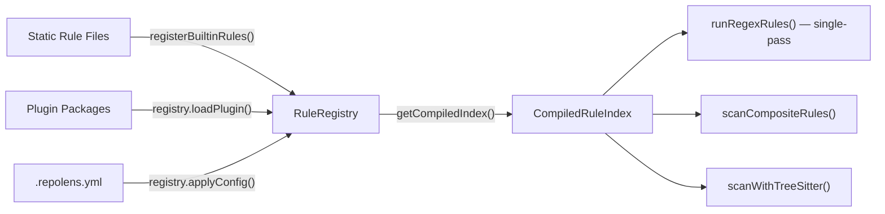
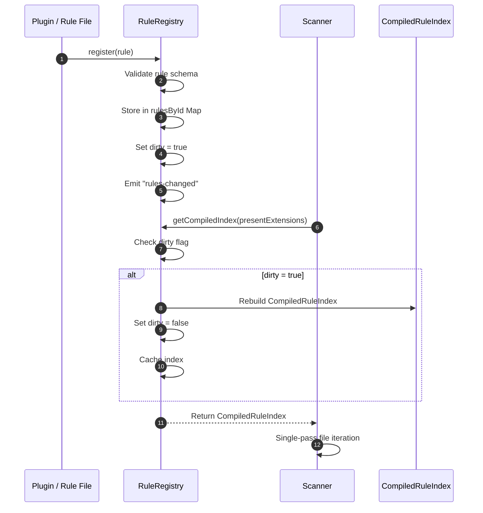
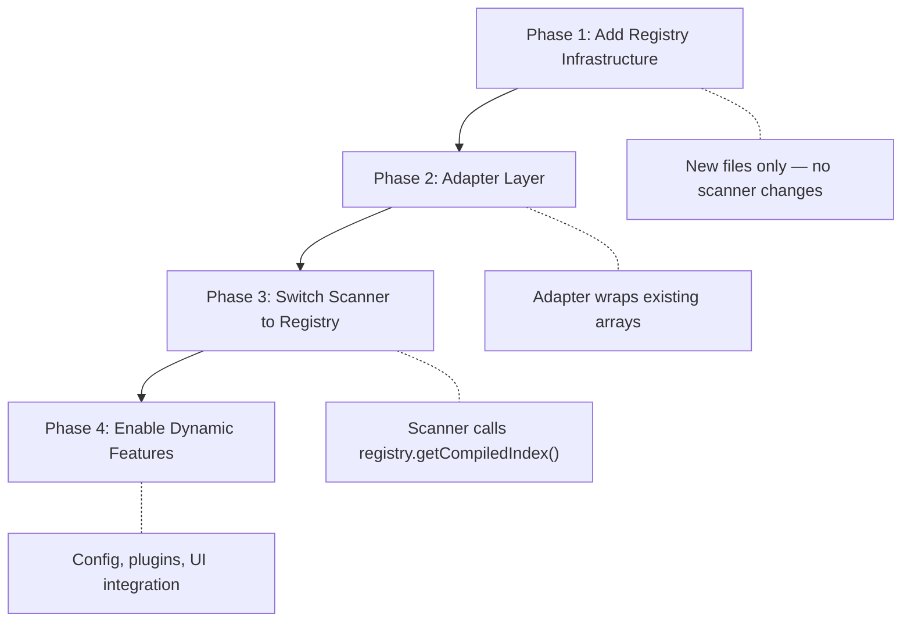

# Scanner Rule Registry — Design Spec

> **Status**: Draft  
> **Author**: architect agent  
> **Date**: 2026-03-09  
> **Scope**: `lib/code/scanner/` — extensible rule management system

---

## Problem Statement

RepoLens's scanner currently manages 268+ rules across 5 static TypeScript arrays (`SECURITY_RULES`, `SECURITY_LANG_RULES`, `BAD_PRACTICE_RULES`, `RELIABILITY_RULES`, `FRAMEWORK_RULES`) plus separate arrays for composite and tree-sitter rules. These arrays are concatenated into a module-level `RULES` const in `scanner.ts` at import time.

This approach has scaling problems:

1. **No dynamic registration** — Adding a rule requires editing a source file and redeploying. Third-party or user-defined rules are impossible.
2. **No per-project configuration** — Every scanned repository gets the same rule set. Users cannot disable noisy rules or enable domain-specific ones.
3. **Implicit grouping** — A rule's "group" is determined by which file it lives in (`rules-security.ts` vs `rules-quality.ts`), which is fragile and invisible to consumers.
4. **No metadata for tooling** — Rules lack version, author, tags, and deprecation info, making it hard to build UIs for rule browsing, filtering, or plugin marketplaces.
5. **Three separate rule types** (`ScanRule`, `CompositeRule`, `TreeSitterRule`) are managed by completely different code paths with no unifying abstraction.

## Constraints

- **Must preserve single-pass optimization**: The `buildCompiledRuleIndex()` pattern — pre-compile rules, group by extension, iterate files once — is a hard performance requirement. The registry must not regress this.
- **Client-side execution**: The scanner runs in the browser (main thread or Web Worker). The registry must be lightweight with no Node.js dependencies.
- **Backward compatibility**: Existing static rule arrays must continue to work during migration. No big-bang rewrite.
- **Type safety**: All APIs must be fully typed with TypeScript. No `any` escape hatches.
- **Bundle size**: The registry infrastructure should add minimal overhead (< 2 KB gzipped).

## Options Considered

### Option A: Registry Class (Mutable Singleton)

A `RuleRegistry` class that holds all rules in an internal `Map<string, RegisteredRule>`. Consumers call `registry.register()` / `registry.unregister()`. The compiled index is lazily rebuilt on the next scan when a dirty flag is set.

**Pros**: Simple mental model, familiar OOP pattern, easy to test with per-test instances.  
**Cons**: Mutable global state requires careful ordering of `register()` calls; race conditions in async registration.

### Option B: Immutable Builder Pattern

A `RuleRegistryBuilder` produces a frozen `RuleRegistry` snapshot. Each mutation returns a new builder; `.build()` produces the compiled index. The scanner holds a `RuleRegistry` ref and swaps it atomically.

**Pros**: No race conditions, very testable, functional style.  
**Cons**: More allocations on every rule change (registry rebuild creates new Maps), more conceptual overhead for plugin authors.

### Option C: Event-Driven Registry (Hybrid)

A mutable `RuleRegistry` with a **dirty flag** and **event emitter**. Mutations (`register`, `unregister`, `configure`) set the dirty flag. `getCompiledIndex()` checks the flag and recompiles lazily. Events notify consumers of changes.

**Pros**: Combines simplicity of mutable state with lazy recompilation; events decouple the registry from the scanner; supports future use cases (UI updates on rule changes).  
**Cons**: Slightly more complex than Option A; event cleanup needed.

### Recommendation: Option C — Event-Driven Registry

Option C best fits the constraints:

- **Lazy recompilation** ensures the single-pass optimization is preserved — the compiled index is only rebuilt when actually needed (i.e., next scan after a rule change), not on every `register()` call.
- **Events** allow the future issues panel UI to react to registry changes without tight coupling.
- **Mutable with dirty flag** is simpler for plugin authors than the builder pattern (Option B) while being safer than raw mutation (Option A) because compilation is deferred.

---

## Recommended Architecture

### High-Level Overview



### Data Flow: Rule Registration to Scan Execution



---

## Component Design

### 1. RuleRegistry — Core Registry Class

**Responsibility**: Central authority for all scanner rules. Manages registration, validation, configuration, and compiled index lifecycle.

**Location**: `lib/code/scanner/rule-registry.ts`

```typescript
export class RuleRegistry {
  // --- Internal state ---
  private rulesById: Map<string, RegisteredRule>
  private plugins: Map<string, LoadedPlugin>
  private config: RegistryConfig
  private dirty: boolean
  private cachedIndex: CompiledRuleIndex | null
  private cachedExtensions: Set<string> | null
  private listeners: Map<RegistryEvent, Set<RegistryListener>>

  // --- Construction ---
  constructor()
  static createDefault(): RuleRegistry  // factory with builtins pre-loaded

  // --- Rule management ---
  register(rule: RuleDefinition): void
  registerMany(rules: RuleDefinition[]): void
  unregister(ruleId: string): boolean
  has(ruleId: string): boolean
  get(ruleId: string): RegisteredRule | undefined
  getAllRules(): RegisteredRule[]
  getRulesByCategory(category: IssueCategory): RegisteredRule[]
  getRulesByTag(tag: string): RegisteredRule[]

  // --- Plugin management ---
  loadPlugin(plugin: ScannerPlugin): void
  unloadPlugin(pluginName: string): void
  getLoadedPlugins(): LoadedPlugin[]

  // --- Configuration ---
  applyConfig(config: RegistryConfig): void
  isEnabled(ruleId: string): boolean
  setSeverityOverride(ruleId: string, severity: IssueSeverity): void

  // --- Compiled index (for scanner consumption) ---
  getCompiledIndex(presentExtensions: Set<string>): CompiledRuleIndex
  invalidate(): void  // force recompilation on next access

  // --- Events ---
  on(event: RegistryEvent, listener: RegistryListener): () => void
  off(event: RegistryEvent, listener: RegistryListener): void

  // --- Diagnostics ---
  getStats(): RegistryStats
}
```

**Key behaviors**:

- `register()` validates the rule against the schema, checks for ID conflicts, stores it, and sets `dirty = true`.
- `getCompiledIndex()` is the **only** hot path. If `dirty` is `false` and `presentExtensions` matches the cached set, it returns the cached `CompiledRuleIndex` — zero cost. If `dirty` or extensions changed, it recompiles.
- The registry is **not a singleton** by default. `createDefault()` returns a pre-populated instance. Tests can create isolated instances with no rules.

### 2. RuleDefinition — Extended Rule Metadata Schema

**Responsibility**: Unified type for all rule types with rich metadata.

```typescript
/** Discriminated union for all rule types */
export type RuleDefinition =
  | RegexRuleDefinition
  | CompositeRuleDefinition
  | TreeSitterRuleDefinition

/** Base metadata shared by all rule types */
interface RuleMetadata {
  // --- Identity (required) ---
  id: string               // Unique ID, e.g. "security/hardcoded-aws-key"
  title: string            // Human-readable name
  description: string      // What the rule detects and why it matters

  // --- Classification ---
  category: IssueCategory  // "security" | "bad-practice" | "reliability"
  severity: IssueSeverity  // "critical" | "warning" | "info"
  group: string            // Replaces implicit file-based grouping
  tags: string[]           // Freeform tags for filtering

  // --- Remediation ---
  suggestion?: string
  fix?: string
  fixDescription?: string
  learnMoreUrl?: string

  // --- Compliance mapping ---
  cwe?: string
  owasp?: string

  // --- Confidence ---
  confidence?: 'high' | 'medium' | 'low'

  // --- Registry metadata ---
  version?: string         // SemVer, e.g. "1.0.0"
  author?: string          // Author or plugin name
  deprecated?: boolean     // When true, rule is skipped with a warning
  replacedBy?: string      // ID of the replacement rule
  enabled?: boolean        // Default enabled state (default: true)
  requiresContent?: boolean
}
```

**Discriminated rule types**:

```typescript
interface RegexRuleDefinition extends RuleMetadata {
  type: 'regex'
  pattern: string
  patternOptions?: {
    caseSensitive?: boolean
    regex?: boolean
    wholeWord?: boolean
  }
  fileFilter?: string[]
  excludePattern?: RegExp
  excludeFiles?: RegExp
}

interface CompositeRuleDefinition extends RuleMetadata {
  type: 'composite'
  fileFilter: string[]
  requiredPatterns: RegExp[]
  sinkPattern: RegExp
  mitigations?: RegExp[]
  mustNotContain?: RegExp[]
  sourceBeforeSink?: boolean
  maxLineDistance?: number
  excludeFiles?: RegExp
}

interface TreeSitterRuleDefinition extends RuleMetadata {
  type: 'tree-sitter'
  query: string
  languages: string[]
  captureName?: string
  excludeFiles?: RegExp
}
```

**Migration from `ScanRule`**: The existing `ScanRule` interface maps cleanly to `RegexRuleDefinition`. A `fromLegacyScanRule()` adapter adds the missing fields (`type`, `group`, `tags`) with sensible defaults (details in Migration section).

### 3. RegisteredRule — Internal Wrapper

```typescript
interface RegisteredRule {
  definition: RuleDefinition
  source: 'builtin' | 'plugin' | 'user'
  pluginName?: string
  registeredAt: number
  overrides: {
    enabled?: boolean
    severity?: IssueSeverity
  }
}
```

### 4. CompiledRuleIndex — Scanner-Facing Compiled Data

**Responsibility**: The compiled, read-only artifact consumed by the scanner's hot loop. Produced by `RuleRegistry.getCompiledIndex()`.

```typescript
interface CompiledRuleIndex {
  regexByExtension: Map<string, CompiledRegexRule[]>
  regexUniversal: CompiledRegexRule[]
  compositeByExtension: Map<string, CompiledCompositeRule[]>
  compositeUniversal: CompiledCompositeRule[]
  treeSitterByLanguage: Map<string, TreeSitterRuleDefinition[]>
  totalCompiled: number
  compiledAt: number
}

interface CompiledRegexRule {
  rule: RegexRuleDefinition
  regex: RegExp
  isSecurityCritical: boolean
  effectiveSeverity: IssueSeverity  // After config overrides
}

interface CompiledCompositeRule {
  rule: CompositeRuleDefinition
  compiledRequiredPatterns: RegExp[]
  isSecurityCritical: boolean
  effectiveSeverity: IssueSeverity
}
```

**Key design decisions**:

- The compiled index is **immutable** — once built, it never changes. A new index replaces it when rules change.
- Extension grouping and dead-rule pruning happen at compile time, identical to the current `buildCompiledRuleIndex()`.
- Composite and tree-sitter rules are now also grouped by extension/language for targeted scanning.

### 5. ScannerPlugin — Plugin API

**Responsibility**: Standard interface for third-party rule packages.

```typescript
interface ScannerPlugin {
  name: string           // e.g. "@repolens/plugin-react-security"
  version: string        // SemVer
  description?: string
  rules: RuleDefinition[]
  setup?(registry: PluginContext): void | Promise<void>
  teardown?(): void
}

interface PluginContext {
  register(rule: RuleDefinition): void
  registerMany(rules: RuleDefinition[]): void
  hasRule(ruleId: string): boolean
  log(level: 'info' | 'warn' | 'error', message: string): void
}

interface LoadedPlugin {
  plugin: ScannerPlugin
  ruleCount: number
  loadedAt: number
  errors: string[]  // Validation errors from individual rules
}
```

**Plugin lifecycle**:

1. `registry.loadPlugin(plugin)` validates the plugin manifest.
2. All `plugin.rules` are validated individually — invalid rules are skipped with errors logged.
3. `plugin.setup(ctx)` is called with a `PluginContext` for additional dynamic registration.
4. Rule IDs are auto-namespaced: if a rule ID doesn't contain `/`, it's prefixed as `{pluginName}/{ruleId}`.
5. `registry.unloadPlugin(name)` calls `plugin.teardown()`, removes all rules from that plugin, and sets `dirty = true`.

**Example plugin**:

```typescript
const reactSecurityPlugin: ScannerPlugin = {
  name: '@repolens/react-security',
  version: '1.0.0',
  description: 'Additional React security patterns',
  rules: [
    {
      type: 'regex',
      id: 'react-open-redirect',
      group: 'react',
      tags: ['react', 'redirect', 'web'],
      category: 'security',
      severity: 'warning',
      title: 'Potential Open Redirect',
      description: 'window.location assigned from user input.',
      pattern: 'window\\.location\\s*=\\s*(?:req|params|query)',
      patternOptions: { regex: true },
      fileFilter: ['.tsx', '.jsx', '.ts', '.js'],
    },
  ],
}
```

### 6. RegistryConfig — Per-Project Configuration

**Responsibility**: Enable/disable rules and override severity per project.

```typescript
interface RegistryConfig {
  disable?: string[]                           // Rule IDs or glob patterns
  enable?: string[]                            // Override default enabled=false
  severityOverrides?: Record<string, IssueSeverity>
  disablePlugins?: string[]
  disableTags?: string[]                       // Tag-based bulk disable
}
```

**Config file format** (`.repolens.yml` in repository root):

```yaml
scanner:
  disable:
    - console-log
    - any-type
    - "python-*"         # Glob: all rules starting with "python-"
  severity:
    todo-fixme: info
    hardcoded-secret: warning
  disablePlugins:
    - "@company/internal-rules"
  disableTags:
    - java
    - kotlin
```

**Resolution order** (highest priority first):

1. `.repolens.yml` `disable` / `enable` — explicit per-rule overrides
2. `.repolens.yml` `disableTags` — tag-based bulk disable
3. `.repolens.yml` `disablePlugins` — plugin-level disable
4. `RuleDefinition.enabled` — rule's default from its definition
5. Default: `true` (rules are enabled unless explicitly disabled)

**Config loading**: The scanner reads `.repolens.yml` from the `CodeIndex` file map (already fetched as part of the repository). Parsing uses a lightweight YAML parser. The config is passed to `registry.applyConfig()` before scanning.

---

## API Contracts

### Registry → Scanner Integration

The scanner's `runRegexRules()` currently calls `buildCompiledRuleIndex(presentExtensions)`. After migration, it calls `registry.getCompiledIndex(presentExtensions)`:

```typescript
// Before (current):
const { rulesForExtension, universalRules, rulesEvaluated } =
  buildCompiledRuleIndex(presentExtensions)

// After (registry):
const compiled = registry.getCompiledIndex(ctx.presentExtensions)
const { regexByExtension, regexUniversal } = compiled
```

The inner loop remains **identical** — the registry only changes how the compiled index is produced.

### Registry Events

```typescript
type RegistryEvent =
  | 'rules-changed'
  | 'plugin-loaded'
  | 'plugin-unloaded'
  | 'config-applied'

type RegistryListener = (event: {
  type: RegistryEvent
  ruleIds?: string[]
  pluginName?: string
}) => void
```

### Validation Contract

`register()` throws `RuleValidationError` for:

| Condition | Error Code |
| --------- | ---------- |
| Missing required fields (`id`, `title`, `description`, `category`, `severity`, `type`) | `MISSING_FIELD` |
| Duplicate rule ID (same source) | `DUPLICATE_ID` |
| Invalid regex pattern (fails `new RegExp()`) | `INVALID_PATTERN` |
| Unknown `type` value | `INVALID_TYPE` |
| `replacedBy` references non-existent rule | `INVALID_REFERENCE` (warning only) |
| `fileFilter` contains unknown extensions | `UNKNOWN_EXTENSION` (warning only) |

Warnings are emitted via events but do not prevent registration.

---

## Error Handling

### Invalid Rules

Rules failing validation during `register()` throw `RuleValidationError` with structured data. During plugin loading, invalid rules are collected in `LoadedPlugin.errors` and skipped.

### Duplicate IDs

- **Same source**: throw `DUPLICATE_ID` error.
- **Different source** (e.g., plugin overriding builtin): allow with a `warn`-level event. Newer registration wins. This enables intentional rule replacement.

### Conflicting Patterns

Not enforced at the registry level. Two rules matching the same code is expected (e.g., general "hardcoded secret" + specific "AWS key"). Deduplication happens at scanner output via `(ruleId, file, line)`.

---

## Migration Path

Migration is **incremental** over 4 phases. Each phase is independently shippable and backward compatible.

### Phase 1: Introduce Registry Infrastructure (Non-Breaking)

**What**: Add `rule-registry.ts`, `RuleDefinition` types, and `RuleRegistry` class. Existing code unchanged.

**Files created**:

- `lib/code/scanner/rule-registry.ts`
- `lib/code/scanner/rule-definition.ts`

**Files modified**:

- `lib/code/scanner/index.ts` — export new types

**Validation**: All existing tests pass unmodified.

### Phase 2: Adapter Layer — Wrap Static Arrays

**What**: Add `fromLegacyScanRule()` adapters and `registerBuiltinRules()`.

```typescript
// lib/code/scanner/builtin-rules.ts
export function registerBuiltinRules(registry: RuleRegistry): void {
  registry.registerMany(
    SECURITY_RULES.map(r => fromLegacyScanRule(r, 'secrets'))
  )
  registry.registerMany(
    SECURITY_LANG_RULES.map(r => fromLegacyScanRule(r, 'language-security'))
  )
  registry.registerMany(
    BAD_PRACTICE_RULES.map(r => fromLegacyScanRule(r, 'bad-practice'))
  )
  registry.registerMany(
    RELIABILITY_RULES.map(r => fromLegacyScanRule(r, 'reliability'))
  )
  registry.registerMany(
    FRAMEWORK_RULES.map(r => fromLegacyScanRule(r, 'framework'))
  )
  registry.registerMany(
    COMPOSITE_RULES.map(r => fromLegacyCompositeRule(r, 'composite'))
  )
  registry.registerMany(
    TREE_SITTER_RULES.map(r => fromLegacyTreeSitterRule(r))
  )
}

function fromLegacyScanRule(
  rule: ScanRule, group: string
): RegexRuleDefinition {
  return { type: 'regex', group, tags: [group], enabled: true, ...rule }
}
```

Static arrays remain untouched. Add snapshot test comparing old vs new output.

### Phase 3: Switch Scanner to Registry

**What**: `scanner.ts` calls `registry.getCompiledIndex()` instead of `buildCompiledRuleIndex()`.

```typescript
// scanner.ts — Phase 3 change
const defaultRegistry = RuleRegistry.createDefault()

function runRegexRules(ctx: ScanContext): RegexRulesResult {
  const compiled = defaultRegistry.getCompiledIndex(ctx.presentExtensions)
  // ...rest of function unchanged — same single-pass loop
}
```

**Validation**: Same test suite, performance benchmark confirming no regression.

### Phase 4: Enable Dynamic Features

**What**: Expose plugin API, `.repolens.yml` config, and rule metadata to UI.

**Features unlocked**:

- `loadPlugin()` / `unloadPlugin()`
- `applyConfig()` from `.repolens.yml`
- Registry events for UI reactivity
- Full metadata in `getAllRules()` for a rule browser UI

### Migration Diagram



---

## Single-Pass Integration Details

### Recompilation Strategy

- `register()` / `unregister()` / `applyConfig()` set `dirty = true` — O(1).
- **No recompilation during registration.** The index rebuilds only when `getCompiledIndex()` is called with `dirty = true`.
- Between scans, many mutations can happen without compilation cost.
- `getCompiledIndex(presentExtensions)` also triggers recompilation if the extension set changes (different repo).

### Extension Matching Optimization

```typescript
if (!dirty && setsAreEqual(cachedExtensions, presentExtensions)) {
  return cachedIndex  // Fast path: zero cost
}
// Slow path: recompile
```

### Compilation Cost

Recompilation iterates enabled rules (~268 currently) and calls `buildSearchRegex()` per regex rule. Same cost as current `buildCompiledRuleIndex()`. Takes < 1ms. Even with 1000+ plugin rules, remains negligible vs actual file scanning.

### Per-Scan Cost

Zero overhead vs current system. `getCompiledIndex()` returns cached index in O(1). Scanner's inner loop is identical: `regexByExtension.get(ext)` + `regexUniversal` → iterate lines → test regexes.

---

## Risks & Mitigations

| Risk | Likelihood | Impact | Mitigation |
| ---- | ---------- | ------ | ---------- |
| Performance regression from registry overhead | Low | High | `getCompiledIndex()` is a cache lookup; benchmark Phase 3 |
| ID collisions between plugins | Medium | Medium | Auto-namespace IDs with plugin name; warn on override |
| Config file parsing errors | Medium | Low | Graceful fallback: warn and scan with defaults |
| Plugin code executing in browser | Medium | High | Plugins provide data only; `setup()` uses restricted `PluginContext` |
| Bundle size increase | Low | Low | Registry is ~200 LOC with no dependencies |
| Migration stalls at partial phase | Medium | Medium | Each phase is independently shippable |

---

## Future Considerations (Out of Scope)

- **Rule priority/ordering** — `priority` field for controlling execution order.
- **Rule dependencies** — `dependsOn: string[]` for inter-rule requirements.
- **Auto-fix execution** — `fixFn: (match, context) => string` for automated fixes.
- **Rule marketplace** — UI for browsing and installing community rule packages.
- **Remote rule loading** — Fetching rules from URLs or npm at runtime.
- **AST rule integration** — Unifying `ast-analyzer.ts` under the registry with `ASTRuleDefinition`.
- **Shared state between rules** — Cross-file context for composite patterns.
